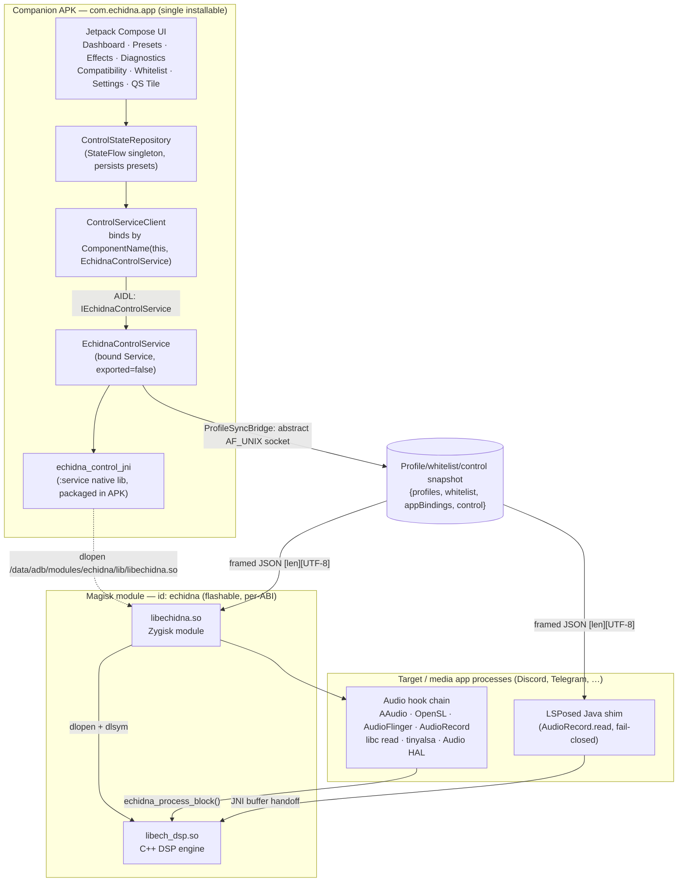
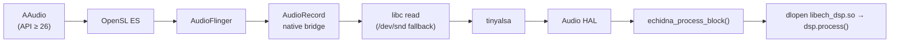
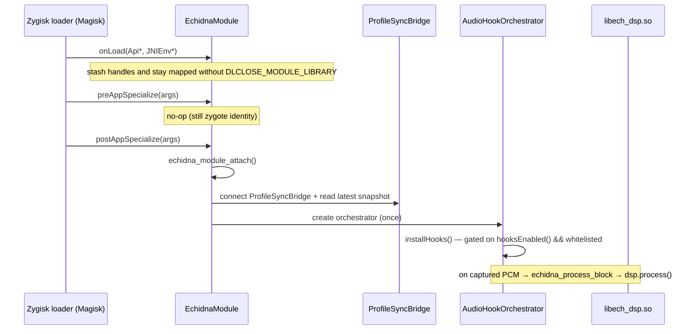

# Architecture

This page describes the **real, end-to-end architecture** of Echidna as it is
built in this repository — the companion app, the in-app control service, the
JNI bridge, the Zygisk native module, the DSP engine, and the LSPosed
compatibility shim. Rooted-emulator testing now proves the service-side native
DSP path and one live `AudioRecord.read` interception slice; broader hook
coverage, Magisk flashing, LSPosed injection, and physical-device SELinux/HAL
behavior are still marked as release-device validation.

## Component overview

Echidna ships as a **single installable APK** (the companion app) plus a
**flashable Magisk module** that carries the native libraries. There is no
separate `com.echidna.control` package — the control service is hosted *inside*
the companion app process.

### The six runtime pieces

| Component | Artifact | Runs in | Role |
| --- | --- | --- | --- |
| **Companion app + UI** | `app-debug.apk` / `app-release.apk` | its own process (`com.echidna.app`) | Compose UI over a `ControlStateRepository` StateFlow singleton; binds the control service; persists presets. |
| **Control service** | `EchidnaControlService` (in the same APK) | companion app process | Bound `Service` implementing the unified AIDL; owns profile/whitelist/control state; publishes the profile-sync snapshot. |
| **JNI bridge** | `echidna_control_jni` (`.so` in the APK) | companion app process | App-side native glue; `dlopen`s the Magisk-delivered `libechidna.so` for status/control. |
| **Zygisk module** | `libechidna.so` (Magisk `zygisk/<abi>.so`) | every specialized app process | Registered Zygisk module; installs the audio hook chain and routes captured PCM through the DSP. |
| **DSP engine** | `libech_dsp.so` (Magisk `system/lib(64)`) | whichever process loaded the hooks | Real-time C++ effect chain; exposes the `echidna_process_block` C ABI. |
| **LSPosed shim** | `shim-release.apk` (`com.echidna.lsposed`) | LSPosed-scoped app process | Optional Java `AudioRecord` fallback; reads the same profile-sync snapshot as native readers. |

## Control plane: app to service to native

The control plane was **repackaged into a single-APK topology** (t2-e6). The
older design bound to a phantom `com.echidna.control` package that had no
installable host; that has been removed.

- `ControlServiceClient` binds with
  `ComponentName(context, EchidnaControlService::class.java)` — an **in-package**
  bind, so it resolves at runtime. The service is declared `exported="false"`.
- The companion app's Gradle build folds the `:service` module in directly
  (`include(":service")` with a `projectDir` redirect), so the service, the
  **single canonical AIDL**, and the `echidna_control_jni` native library are all
  bundled into the one APK. The duplicate app-side AIDL copy was deleted, so
  there is exactly one `IEchidnaControlService` contract.
- The AIDL surface (`IEchidnaControlService`) carries the full control API:
  status/refresh (`getModuleStatus`, `refreshStatus():String`), whitelist and
  binding queries (`getWhitelistBindings`), global controls
  (`setMasterEnabled`, `setBypass`, `triggerPanic`, `setSidetone`,
  `getControlState`), plus profile push, telemetry streaming
  (`RemoteCallbackList`), and `processBlock`.
- `getModuleStatus`/`refreshStatus` return a **combined status JSON** assembled
  from the real module status, a human-readable SELinux state, and a live
  `AudioStackProbe` (manufacturer, `ro.board.platform`, AAudio / low-latency /
  pro-audio features, output sample rate and frames-per-buffer). This replaced
  the previously hard-coded "Qualcomm QSSI / Enforcing" placeholder data.

## Data plane: audio capture to DSP

When the Zygisk module attaches inside a target process it installs a **layered
hook chain**. Each manager, when it captures a PCM block, calls
`echidna_process_block(...)`, which lazily `dlopen`s `libech_dsp.so`, resolves the
four DSP entrypoints, and calls `dsp.process(...)`, then writes the processed
PCM back in place. All hooking is gated on `hooksEnabled()` **and**
`isProcessWhitelisted()` — the module never hooks unconditionally.

**Hook install order** (from the orchestrator, highest priority first):

The first manager that installs successfully flips internal status to `kHooked`,
which the control service surfaces via `getModuleStatus`. The chain is a
priority list, not mutually exclusive — several managers can be active if an app
uses multiple audio paths.

### Zygisk module lifecycle

`libechidna.so` is a genuine Zygisk module (t2-e9). It registers via
`REGISTER_ZYGISK_MODULE(EchidnaModule)` against the Zygisk API v4 header
(`native/zygisk/include/zygisk.hpp`):

`postAppSpecialize` is the attach point because by then `/proc/self/cmdline`
reflects the **target app's** process name, which the whitelist check reads. The
module deliberately keeps itself mapped so the installed inline/PLT hooks persist
for the process lifetime. The `AudioRecord.read` slice has rooted x86_64 emulator
coverage through the interception probe. Full Magisk loader lifecycle, reboot
survival, arbitrary target-app specialization, and non-`AudioRecord` hook
managers still require release-device validation.

### Multi-ABI hooking

The native libraries are cross-compiled **per ABI** (t2-e10) — `arm64-v8a`
(primary), `armeabi-v7a`, `x86_64` — into `build/<abi>/lib/`. The inline-hook
trampoline support differs by ABI (t2-e11):

- **arm64-v8a** — full trampoline (LDR X16 / BR X16 with relocation fixups); the
  primary, most-tested path.
- **x86_64** — full trampoline implemented (14-byte absolute `jmp [rip]` patch
  with an allow-listed length decoder that relocates RIP-relative and rel32
  operands, failing closed on anything unrecognized). Verified with a host
  decoder + end-to-end hook harness, plus the rooted-emulator `AudioRecord`
  interception probe.
- **armeabi-v7a** — **graceful degrade**: it builds and loads, but `install()`
  returns `false` and emits a `hook_unsupported_abi` log signal, because Thumb-2 /
  IT-block relocation is unsafe and untested. armv7 hooking is intentionally
  non-functional rather than silently wrong.

## Profile / telemetry sync: service-owned snapshot socket

The control service publishes profile, whitelist, and control state to the
native side (and to the LSPosed shim) through **`ProfileSyncBridge`**: one
service-owned abstract `AF_UNIX` socket named `echidna_profiles`.

- The snapshot JSON is `{profiles, whitelist, appBindings, control}`. `control`
  is additive (`masterEnabled`, `bypass`, `panicUntilEpochMs`, `sidetone`);
  readers that predate it still work.
- Wire framing is `[4-byte big-endian length][UTF-8 JSON]`.
- Every connecting reader receives the latest snapshot immediately and then
  remains connected for later update frames. This lets multiple hooked app
  processes observe the same policy without racing to own a filesystem socket.
- The previous filesystem endpoint `/data/local/tmp/echidna_profiles.sock` is no
  longer used by current builds.

### Shared-memory fallback and telemetry

The config and telemetry helper regions use file-backed mappings under
`/data/local/tmp/echidna` via `android_shared_memory.h`. The profile-sync socket
is now the primary policy transport, but these regions still provide:

- a fail-closed startup fallback when the service is not reachable yet; and
- the live telemetry path that hooked apps update for diagnostics.

## LSPosed shim path (Java-API apps)

For apps that capture through Java `AudioRecord`, the LSPosed shim provides a
fallback that does **not** depend on the Zygisk module being active. It resolves
per-app policy by reading the **same ProfileSyncBridge snapshot** (t2-e8):

- `ProfileSyncReceiver` connects to the same abstract `AF_UNIX` socket and reads
  the identical framing — it mirrors the native receiver rather than inventing a
  new wire format.
- `ProfileSnapshot` parses `{profiles, whitelist, appBindings, control}` and
  exposes `isProcessAllowed(pkg, proc)`, `resolveProfile(pkg)`,
  `isGloballyEnabled()`, and `engineMode()`.
- **Fail-closed by construction:** the default snapshot is `empty()` (empty
  whitelist, global off). Before any push, or on any unreadable/unparseable
  snapshot, resolution denies hooking. Hooking is enabled **only** when globally
  enabled *and* the package/process is explicitly whitelisted `true`. When a
  buffer is not allowed, `AudioRecordHook` zeroes the returned buffer and forces
  `read()` to return 0.

### Multi-reader snapshot delivery

The previous profile-sync contract was single-holder: each hooked process bound
the same filesystem socket, so only the last binder received pushes. The current
contract inverts ownership. The companion service owns the publisher socket, and
Zygisk/LSPosed readers connect to it. A reader that starts after the last profile
mutation still receives the cached snapshot immediately.

## Threading and latency

- The DSP runs **synchronously inside the capture callback** by default
  (in-place processing), which is the low-latency path. A **hybrid** mode copies
  into a lock-free ring buffer and lets a worker apply heavier transforms, with
  an overrun watchdog and xrun counting; this trades latency for quality. Latency
  modes are exposed per preset (Low-Latency / Balanced / High-Quality). See
  [DSP & Effects](dsp-effects.md).
- The snapshot is pushed on mutation and at service startup (`loadFromDisk`);
  late readers also receive the service's cached snapshot as soon as they connect.

## What is verified vs device-gated

- **Verified in this environment:** the single-APK topology and AIDL unification
  build and the debug/release APKs assemble; all six per-ABI `.so` cross-compile
  and link (arm64-v8a / armeabi-v7a / x86_64, DSP + Zygisk); host DSP tests pass;
  the x86_64 trampoline passes a host end-to-end hook harness; the app installs,
  launches crash-free, and navigates on an unrooted emulator; rooted Android
  13/14 emulators pass app instrumentation with native `processBlock` coverage
  and an `AudioRecord.read` interception probe with `processed=1`.
- **Still release-device validation:** Magisk flashing/reboot/module-manager load,
  live LSPosed shim injection, physical-device Zygisk lifecycle on arm64,
  AAudio/OpenSL/AudioFlinger/tinyalsa/HAL hooks, SELinux / audio-HAL interaction,
  and multi-process profile-sync behavior. See [Verification](verification.md)
  for the full matrix and a reproduce-on-device procedure.
