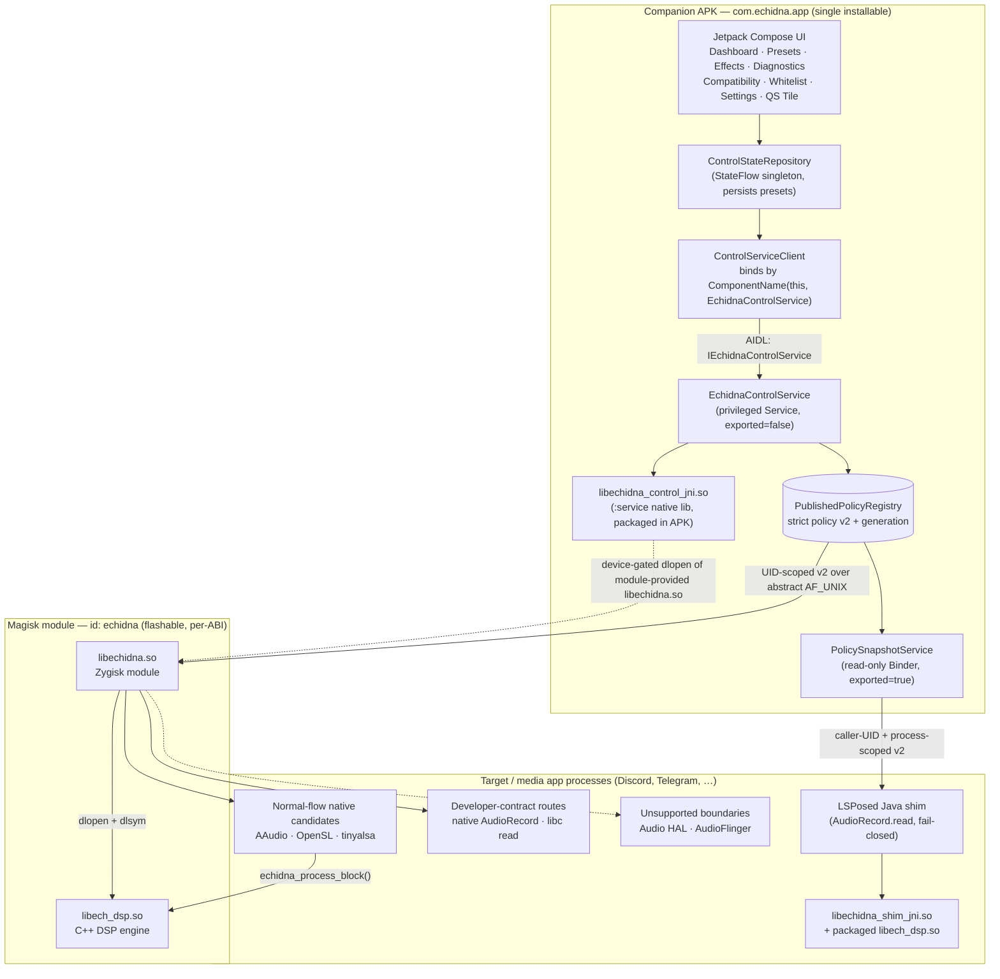
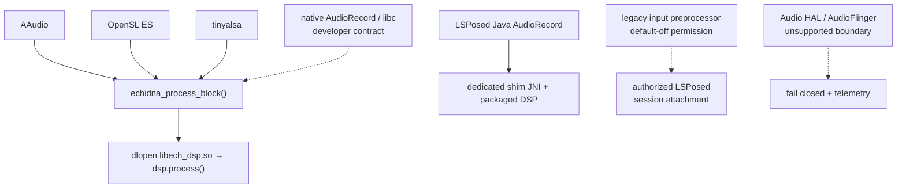
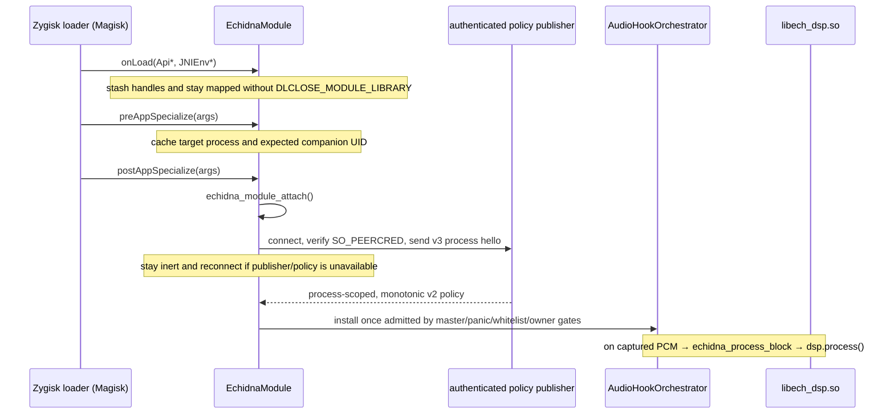

# Architecture

This page describes the **real, end-to-end architecture** of Echidna as it is
built in this repository — the companion app, the in-app control service, the
JNI bridge, the Zygisk native module, the DSP engine, and the LSPosed
compatibility shim. Rooted-emulator testing proves the service-side native DSP
path. A native `AudioRecord.read` interception slice passed before the current
explicit-contract redesign and is retained as historical evidence only. Current
capture routes, Magisk flashing, LSPosed injection, and physical-device
SELinux/HAL behavior remain device validation.

## Component overview

Echidna ships a primary **companion APK**, an optional **LSPosed shim APK**, and a
**flashable Magisk module** that carries the Zygisk engine and DSP. There is no
separate `com.echidna.control` package — the control service is hosted *inside*
the companion app process.

### The six runtime pieces

| Component | Artifact | Runs in | Role |
| --- | --- | --- | --- |
| **Companion app + UI** | `app-debug.apk` / `app-release.apk` | its own process (`com.echidna.app`) | Compose UI over a `ControlStateRepository` StateFlow singleton; binds the control service; persists presets. |
| **Control service** | `EchidnaControlService` plus `PolicySnapshotService` (in the same APK) | companion app process | The private AIDL owns mutations. The exported read-only provider authenticates LSPosed callers and exposes only their scoped policy. |
| **JNI bridge** | `libechidna_control_jni.so` (in the APK) | companion app process | App-side native glue; attempts to `dlopen` the Magisk-delivered engine for status/control and fails closed when unreachable. |
| **Zygisk module** | `libechidna.so` (Magisk `zygisk/<abi>.so`) | every specialized app process | Registered Zygisk module; attempts eligible capture managers and routes captured PCM through the DSP. |
| **DSP engine** | `libech_dsp.so` (Magisk `system/lib(64)`) | whichever process loaded the hooks | Real-time C++ effect chain; exposes the `echidna_process_block` C ABI. |
| **LSPosed shim** | `shim-release.apk` (`com.echidna.lsposed`) | LSPosed-scoped app process | Optional Java `AudioRecord` fallback; bundles only `libechidna_shim_jni.so` plus `libech_dsp.so` and fetches authenticated, process-scoped policy over Binder. |

## Control plane: app to service to native

The control plane was **repackaged into a single-APK topology** (t2-e6). The
older design bound to a phantom `com.echidna.control` package that had no
installable host; that has been removed.

- `ControlServiceClient` binds with
  `ComponentName(context, EchidnaControlService::class.java)` — an **in-package**
  bind, so it resolves at runtime. The service is declared `exported="false"`.
- The companion app's Gradle build folds the `:service` module in directly
  (`include(":service")` with a `projectDir` redirect), so the service, the
  **single canonical AIDL**, and the `echidna_control_jni` native library are all
  bundled into the one APK. The duplicate app-side AIDL copy was deleted, so
  there is exactly one `IEchidnaControlService` contract.
- The AIDL surface (`IEchidnaControlService`) carries the full control API:
  status/refresh (`getModuleStatus`, `refreshStatus():String`), whitelist and
  binding queries (`getWhitelistBindings`), global controls
  (`setMasterEnabled`, `setBypass`, `triggerPanic`, `setSidetone`,
  `getControlState`), plus profile push, telemetry streaming
  (`RemoteCallbackList`), and `processBlock`.
- `getModuleStatus`/`refreshStatus` return a **combined status JSON** assembled
  from the real module status, a human-readable SELinux state, and a live
  `AudioStackProbe` (manufacturer, `ro.board.platform`, AAudio / low-latency /
  pro-audio features, output sample rate and frames-per-buffer). This replaced
  the previously hard-coded "Qualcomm QSSI / Enforcing" placeholder data.
- Availability is not runtime proof. `policyToolAvailable`, `policyAppliedVerified`,
  `nativeRouteVerified`, and `javaFallbackRecommended` are separate signals; neither Zygisk nor a
  policy tool being present proves that a transformed buffer was observed.
- The exported `PolicySnapshotService` is a deliberately narrow exception to the private control
  surface. It authenticates Binder's caller UID against the claimed process and cannot mutate
  policy. The privileged `IEchidnaControlService` remains non-exported.

## Data plane: audio capture to DSP

When the Zygisk module attaches inside a target process it attempts every eligible
capture manager. A manager that captures a PCM block calls
`echidna_process_block(...)`, which lazily `dlopen`s `libech_dsp.so`, resolves the
four DSP entrypoints, and calls `dsp.process(...)`, then writes the processed
PCM back in place. All hooking is gated on `hooksEnabled()` **and**
`isProcessWhitelisted()` — the module never hooks unconditionally.

**Capture-route support** is a code-owned contract in
`native/zygisk/src/hooks/capture_route_reachability.h`:

| Route | Status | PCM metadata source / reason |
| --- | --- | --- |
| AAudio | Operational candidate | Stable AAudio stream getters. |
| OpenSL ES | Operational candidate | Recorder sink PCM descriptor and tested wrapper lifecycle. |
| tinyalsa | Operational candidate | `pcm_open` configuration. |
| LSPosed Java `AudioRecord` | Operational candidate | Java sample-rate, channel-count, and format getters. |
| Legacy input preprocessor effect ABI | Experimental attachment candidate | ABI/lifecycle/audio/RT tests pass; eligible system/vendor HIDL configs can stage next-boot registration, and the default-off LSPosed path requests authorized per-session attachment. No device audio proof. |
| Native `AudioRecord` | Developer contract only | Requires `ECHIDNA_AR_SR`, `ECHIDNA_AR_CH`, and `ECHIDNA_AR_FORMAT`; normal app specialization does not provide them. |
| libc raw-device read | Developer contract only | Requires `ECHIDNA_LIBC_SR`, `ECHIDNA_LIBC_CH`, and `ECHIDNA_LIBC_FORMAT`. |
| Audio HAL | Unsupported | `unsupported_injection_boundary`; vendor stream objects live behind audioserver. |
| AudioFlinger | Unsupported | `unsupported_injection_boundary`; no stable app-process transform ABI. |

Operational means the route has a reachable code contract, not that it has passed on a physical
device. The orchestrator reports support, metadata source, and the exact unavailable reason in hook
telemetry. This matrix is ABI-qualified: on `armeabi-v7a`, AAudio, OpenSL ES, tinyalsa, native
`AudioRecord`, and libc-read are reported as unsupported before installation. The LSPosed Java/JNI
route and the legacy input preprocessor do not use Echidna's inline-symbol backend and remain
eligible subject to their normal policy and device gates.

Any successful manager flips internal status to `kHooked`, which the control service surfaces via
`getModuleStatus`. Managers are not mutually exclusive: several candidates can be installed when an
app touches multiple APIs. Unsupported or unconfigured routes return false with explicit telemetry.

### Zygisk module lifecycle

`libechidna.so` is a genuine Zygisk module (t2-e9). It registers via
`REGISTER_ZYGISK_MODULE(EchidnaModule)` against the compatibility-focused Zygisk API v3 header
(`native/zygisk/include/zygisk.hpp`):

`preAppSpecialize` caches the target process and resolves the companion package UID while the
zygote-side package registry is still readable. `postAppSpecialize` starts the process-local reader
and activation worker only after sandboxing. A cold publisher does not permanently disable an
eligible process: it remains inert, reconnects with bounded backoff, and installs once a valid
current generation assigns that process to the `zygisk` capture owner. Disconnect, policy revoke,
master-off, bypass, or an active panic hold revoke processing immediately; rollback and conflicting
same-generation payloads are rejected. The module stays mapped so installed inline/PLT hooks can
remain resident while their processing gate is disabled. The earlier rooted x86_64 `AudioRecord.read` probe
predates the current explicit PCM contract and does not prove the current native
route is reachable. Full Magisk loader lifecycle, reboot survival, arbitrary
target-app specialization, and current capture routes require device validation.

### Multi-ABI hooking

The native superbuild targets **four** shared objects per ABI — `libechidna.so`,
`libech_dsp.so`, `libechidna_shim_jni.so`, and `libechidna_preproc.so` — for `arm64-v8a`,
`armeabi-v7a`, and `x86_64`. That is 12 generated targets. Release tooling carries the engine,
DSP, and preprocessor through the Magisk module and shim JNI/DSP through the LSPosed APK. The
preprocessor remains in inert ABI staging until runtime evidence proves a legacy-HIDL system/vendor
registry. The generated next-boot overlay adds only library/effect registration. Separately, the
default-off companion setting can permit the LSPosed shim to request a short-lived capability and
attach the registered effect to one eligible `AudioRecord` session. It does not auto-apply the
effect or prove load, enablement, or mutation on a device. The inline-hook
trampoline support differs by ABI (t2-e11):

- **arm64-v8a** — full trampoline (LDR X16 / BR X16 with relocation fixups); the
  primary, most-tested path.
- **x86_64** — full trampoline implemented (14-byte absolute `jmp [rip]` patch
  with an allow-listed length decoder that relocates RIP-relative and rel32
  operands, failing closed on anything unrecognized). Verified with a host
  decoder + end-to-end hook harness. The earlier rooted-emulator `AudioRecord`
  probe predates the current route contract.
- **armeabi-v7a** — **graceful degrade**: it builds and loads, but `install()`
  rejects direct inline-symbol routes before manager installation with
  `unsupported_armv7_late_symbol_hooking`. This covers AAudio, OpenSL ES, tinyalsa,
  native `AudioRecord`, and libc-read. Thumb-2 / IT-block relocation is unsafe and
  untested, and Zygisk API v3 is not a late-load substitute: its API ends after
  specialization, while its PLT commit applies to ELFs already loaded in memory and
  clears the registrations. Echidna receives authenticated policy after that callback,
  so a complete, process-scoped PLT transaction cannot be installed safely. The LSPosed
  Java/JNI route and official legacy preprocessor remain eligible because they do not
  depend on this inline-symbol backend.

## Authenticated policy v2 delivery

`ProfileStore` persists and publishes one strict, bounded version-2 policy document. It contains
`schemaVersion`, a service-owned monotonic `generation`, `profiles`, `defaultProfileId`,
`appBindings`, `whitelist`, `captureOwners`, the complete `control` object, and an internal
`appIdentities` binding for each resolvable policy package. An identity records the full Android
UID/user and sorted current APK signing-certificate digests at publication time. Unknown or
duplicate keys, malformed Unicode, oversize documents, dangling defaults/bindings, invalid owners,
and incomplete controls fail closed. A pre-identity stored policy is rewritten inert and cannot
activate a route until the companion refreshes it. Process-scoped transport views deliberately omit
the private identity table.

`PublishedPolicyRegistry` is the read-only process-local source shared by the two transports:

- **Zygisk:** `ProfileSyncBridge` owns an Android-user-scoped abstract `AF_UNIX` socket. User 0 keeps
  the compatibility name `echidna_profiles`; other users use `echidna_profiles_u<userId>` so two
  companion instances cannot collide or accept each other's readers. A client must send the v3
  Zygisk hello with its exact process name. The publisher binds the full
  `SO_PEERCRED` UID to the current policy's published package/user/signing identity; PID identifies
  only that socket incarnation. The native reader independently accepts only the companion UID
  cached before specialization. Frames are bounded, length-prefixed UTF-8. Each reader receives only
  its exact/base process view; slow writers and handshake/client counts are bounded. A disconnect
  revokes admission while retaining the generation watermark for safe reconnect.
- **LSPosed:** `PolicySnapshotService` is an explicit, exported, read-only Binder component. It
  binds `Binder.getCallingUid()` to the same current published identity and pins PID plus the live
  callback Binder to one registration incarnation. It returns only the exact/base process view.
  Bounded listeners receive generation invalidations, then fetch the newest scoped document. They
  never receive mutation authority. Provider API v7 uses synchronous Binder transactions for the
  PID-bound capability, telemetry, proof, and drain reports. Those transactions only capture and
  validate UID/PID and enqueue bounded work; signing and proof verification stay off Binder threads.
  The retained v2-v6 one-way transactions fail closed because Android does not provide a caller PID
  for one-way calls.
- A socket LSPosed hello is closed, and an unnegotiated legacy socket reader receives one inert
  fail-closed document before disconnect. The old filesystem endpoint
  `/data/local/tmp/echidna_profiles.sock` is not used.

Android packages sharing one UID are one application-sandbox trust domain, so either sibling can
act for that UID; package/process policy keys still limit which scoped route exists. Full UIDs keep
work-profile users distinct. Resolution is intentionally limited to packages visible to the
companion's Android user (including its launcher-scoped `<queries>` declaration); missing
visibility, uninstall/reinstall UID drift, or signer drift revokes admission without adding
`QUERY_ALL_PACKAGES`, privileged permissions, `/proc` inspection, or SELinux exceptions.
The companion APK must be installed and started inside each Android user/profile that should receive
policy; cross-user service or policy access is never attempted.

### Shared-memory fallback and telemetry

The config and telemetry helper regions use file-backed mappings under
`/data/local/tmp/echidna` via `android_shared_memory.h`. Versioned socket/Binder policy is
authoritative for admission; deprecated shared-file state cannot revive a denied process. The
telemetry region remains the transformed-buffer evidence path consumed by diagnostics.

## LSPosed shim path (Java-API apps)

For apps that capture through Java `AudioRecord`, the LSPosed shim provides a fallback that does
**not** require an active Zygisk route. After the real target process identity is known:

- `ProfileSyncReceiver` explicitly binds the companion's read-only `PolicySnapshotService`,
  registers its listener before the first fetch, and reconnects on provider failure.
- `ProfileSnapshot` accepts only the complete strict v2 schema. `ProfileSnapshotStore` preserves a
  monotonic generation watermark and rejects rollback or conflicting same-generation bytes.
- Policy resolution uses the exact process then base package, selects an app binding or the explicit
  default profile, and requires `captureOwners` to assign the target to `lsposed`.
- **Fail-closed by construction:** the default snapshot is `empty()` (empty
  whitelist, global off). Before any policy fetch, or on any unreadable/unparseable
  snapshot, resolution denies processing. Processing is enabled **only** when globally
  enabled, outside the panic hold, explicitly whitelisted `true`, and assigned to the LSPosed owner.
  A policy change during a read invalidates the transaction so original bytes/results are preserved.

### Multi-reader delivery without shared authority

The previous profile-sync contract was single-holder: each hooked process tried to own one
filesystem socket. Current delivery has one service-owned policy registry, multiple authenticated
native socket readers, and independently authenticated Binder views for LSPosed. Late readers get
the persisted/current generation through their transport; no target process can publish policy.

## Threading and latency

- The DSP runs **synchronously inside the capture callback** by default
  (in-place processing), which is the low-latency path. A **hybrid** mode copies
  into a lock-free ring buffer and lets a worker apply heavier transforms, with
  an overrun watchdog and xrun counting; this trades latency for quality. Latency
  modes are exposed per preset (Low-Latency / Balanced / High-Quality). See
  [DSP & Effects](dsp-effects.md).
- Policy is published on mutation and restored at service startup. Native readers receive scoped
  frames; Binder listeners receive only a generation invalidation and then re-fetch their scoped
  view. Late consumers obtain the current persisted/registry generation through their transport.

## What is verified vs device-gated

- **Verified in this environment:** the single-APK topology and AIDL unification
  build and the debug/release APKs assemble; all 12 superbuild targets cross-compile, while release
  delivery verifies the nine engine/DSP/shim-JNI artifacts; host DSP and preprocessor tests pass;
  the x86_64 trampoline passes a host end-to-end hook harness; the app installs,
  launches crash-free, and navigates on an unrooted emulator; rooted Android
  13/14 emulators passed app instrumentation with native `processBlock` coverage.
  The recorded `AudioRecord.read` probe is historical, pre-redesign evidence.
- **Still release-device validation:** Magisk flashing/reboot/module-manager load,
  live LSPosed shim injection, physical-device Zygisk lifecycle on arm64,
  AAudio/OpenSL/tinyalsa capture, SELinux interaction, and multi-process
  profile-sync behavior. Native AudioRecord/libc need a normal-flow PCM contract;
  Audio HAL/AudioFlinger remain unsupported rather than merely unverified. See
  [Verification](verification.md)
  for the full matrix and a reproduce-on-device procedure.
