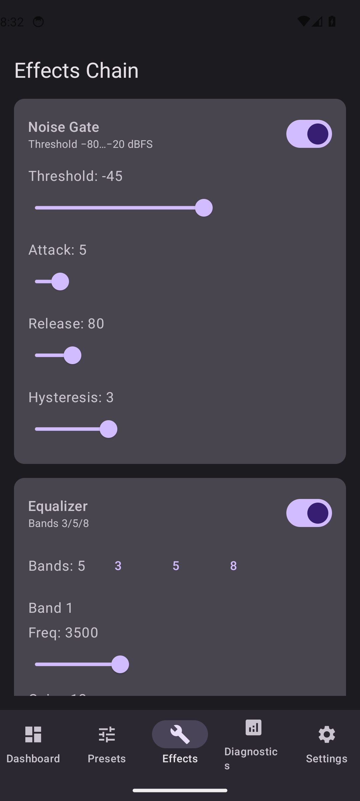
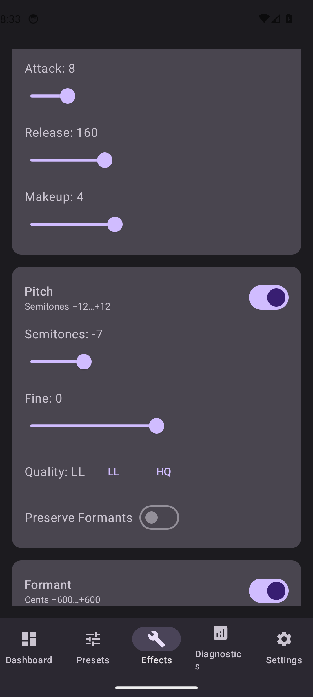
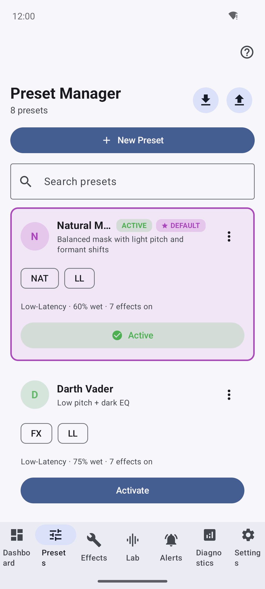

# DSP Pipeline & Effects Reference

Echidna's audio processing lives in `libech_dsp.so` (the DSP engine) and is invoked from
`libechidna.so` inside each hooked audio process (on a device where the hook is active —
device-gated; see [Verification](verification.md)). Captured audio blocks are processed
**synchronously inside the hooked read callback** to minimise copies and latency; a **hybrid**
mode can offload heavier work to a worker thread when a preset asks for quality over latency.

This page documents the processing chain, every effect stage and its parameters (as declared
in `native/dsp/`), the latency/quality modes, the built-in preset catalog, and the signed
plugin system.

---

## The processing chain

Effects run in a fixed order. The dry input is preserved and blended back at the end by the
mix bus, so **Dry/Wet** governs how much processed signal you actually hear.

```
input ──► Gate ──► EQ ──► Compressor/AGC ──► Pitch ──► Formant ──► Auto-Tune ──► Reverb ──► Plugins ──► Mix (dry/wet + output gain) ──► output
   │                                                                                                        ▲
   └────────────────────────────────── dry signal ─────────────────────────────────────────────────────────┘
```

This is the real order in the engine: signed plugin effects are inserted **immediately before
the mix bus**, so they receive the fully conditioned wet signal. Each stage has an independent
on/off toggle; a disabled stage passes audio through untouched.

The C entry points (`native/dsp/include/echidna/dsp/api.h`) are:

- `ech_dsp_initialize(sample_rate, channels, quality_mode)`
- `ech_dsp_update_config(json_config, json_length)` — apply a preset (JSON validated against
  safe ranges before it takes effect)
- `ech_dsp_process_block(input, output, frames)` — process one interleaved float block
- `ech_dsp_shutdown()`

---

## Latency & quality modes

Two orthogonal knobs control the latency/quality trade-off.

**Quality mode** (`ech_dsp_quality_mode_t`, chosen at init and per preset):

| Mode | Target end-to-end latency | Notes |
| ---- | ------------------------- | ----- |
| Low-Latency | 10–15 ms | Cheap transforms only; forces the pitch shifter to its granular backend. |
| Balanced | ~20 ms | |
| High-Quality | 30 ms+ | Enables the phase-vocoder pitch backend and heavier stages. |

**Processing mode** (per preset):

- **Synchronous** — the block is processed in-callback. Lowest latency; the default
  (`block_ms` defaults to 15).
- **Hybrid** — the callback copies to a lock-free ring buffer and a worker thread applies
  heavy transforms, returning the latest available output. Higher latency, higher quality for
  non-real-time uses.

!!! note "Latency-mode safety"
    Under Low-Latency, the engine overrides a preset's request for the high-quality pitch
    backend and uses the granular one instead, keeping the in-callback cost bounded. Presets
    tagged **LL** are tuned to stay inside the low-latency budget.

---

## Effect stages & parameters

Ranges and defaults below are taken from the effect headers in `native/dsp/src/effects/` and
the parameter reference in `spec.md`. "Default" is the value the parameter struct ships with.



*The Effects tab exposes each stage with an independent on/off toggle. A disabled
stage passes audio through untouched. You can preview any preset's chain locally in
[the Lab](usage-lab.md) — no root required.*

### 1. Noise Gate

Attenuates signal below a threshold with soft attack/release and hysteresis to avoid chatter.
The gate opens only after the smoothed envelope reaches `threshold + hysteresis` and closes after it
falls to `threshold - hysteresis`. Envelope, open/closed state, and gain persist across callbacks, so
release continues to silence instead of being reset at each block boundary.

| Parameter | Range | Default | Unit |
| --------- | ----- | ------- | ---- |
| Threshold | −80 … −20 | −45 | dBFS |
| Attack | 1 … 50 | 5 | ms |
| Release | 20 … 500 | 80 | ms |
| Hysteresis | 0 … 12 | 3 | dB |

### 2. Parametric EQ

A stack of biquad bands; select 3 / 5 / 8 bands. Each band is an independent peaking filter.

| Per-band parameter | Range | Default | Unit |
| ------------------ | ----- | ------- | ---- |
| Frequency | 20 … 12 000 | 1000 | Hz |
| Gain | −12 … +12 | 0 | dB |
| Q | 0.3 … 10 | 1.0 | — |

Named starting points: Phone, AM Radio, Warmth, Bright, De-mud, De-harsh, V-curve. Keep
|gain| ≤ 6 dB per band for natural-sounding presets.

### 3. Compressor / AGC

Dynamic range control with a manual mode and an automatic (AGC) mode.

| Parameter | Range / values | Default | Unit |
| --------- | -------------- | ------- | ---- |
| Mode | Manual / Auto (AGC) | Manual | — |
| Threshold | −60 … −5 | −24 | dBFS |
| Ratio | 1.2:1 … 6:1 | 3:1 | — |
| Knee | Hard / Soft (soft amount 0 … 12) | Hard | dB |
| Attack | 1 … 50 | 5 | ms |
| Release | 20 … 500 | 120 | ms |
| Makeup gain | 0 … +12 (auto in AGC) | 0 | dB |

Ratios above 4:1 with a fast release can pump — the UI hints at this.

### 4. Pitch Shift

Shifts pitch with a granular (low-latency) or phase-vocoder (high-quality) backend.

| Parameter | Range / values | Default | Unit |
| --------- | -------------- | ------- | ---- |
| Semitones | −12 … +12 | 0 | st |
| Fine | −100 … +100 | 0 | cents |
| Quality | LL (granular) / HQ (phase vocoder) | LL | — |
| Preserve formants | On / Off | Off | — |

Safe range is −6 … +6 st (a warning is shown beyond ±8); Low-Latency prefers ≤ ±4. When
"preserve formants" is on, formant correction is delegated to the formant stage.



*The Pitch stage. The UI warns beyond the safe range (±8 st) and, under
Low-Latency, forces the granular backend to keep in-callback cost bounded.*

### 5. Formant Shift

Alters perceived vocal-tract size independently of pitch. The
[Pitch Shift screenshot above](#4-pitch-shift) also shows the formant-preserve
control that ties these two stages together.

| Parameter | Range | Default | Unit |
| --------- | ----- | ------- | ---- |
| Cents | −600 … +600 | 0 | cents |
| Intelligibility assist | On / Off | Off | — |

Safe range is −300 … +300 cents (warn beyond ±450). Intelligibility assist tilts the EQ
slightly to preserve clarity at large shifts.

### 6. Auto-Tune (pitch correction)

A monophonic pitch detector quantises to the nearest note of the selected key/scale, then
pitch-shifts to the target and blends by snap strength.

| Parameter | Range / values | Default | Unit |
| --------- | -------------- | ------- | ---- |
| Key | C, C♯/D♭, D … B | C | — |
| Scale | Major, Minor, Chromatic, Dorian, Phrygian, Lydian, Mixolydian, Aeolian, Locrian | Chromatic | — |
| Retune speed | 1 … 200 | 50 | ms |
| Humanize | 0 … 100 | 50 | % |
| Flex-Tune | 0 … 100 | 0 | % |
| Formant preserve | On / Off | Off | — |
| Snap strength | 0 … 100 | 100 | % |

Retune under ~10 ms sounds robotic (the "FX" region); slow retune is more natural. The
Diagnostics **Tuner View** shows detected vs. target note in real time.

Detection uses a rolling, per-channel analysis history and updates on a sample-rate-derived hop, so
64–2048-frame callbacks do not need to contain a complete pitch period. Correction is applied by a
stateful realtime pitch shifter whose delay/phase history survives block boundaries. Retune smoothing
uses the callback's frame duration, keeping the control response consistent at 44.1, 48, and 96 kHz.
Silence, low-correlation input, invalid buffers, and callbacks larger than prepared realtime capacity
fail closed without allocating on the audio thread.

### 7. Reverb

A multi-comb / all-pass room reverb with pre-delay.

| Parameter | Range | Default | Unit |
| --------- | ----- | ------- | ---- |
| Room size | 0 … 100 | 20 | — |
| Damping | 0 … 100 | 30 | — |
| Pre-delay | 0 … 40 | 0 | ms |
| Mix | 0 … 50 | 10 | % |

Reverb mix above ~20 % can reduce call intelligibility.

### 8. Mix (global)

The final stage blends the preserved dry signal with the processed wet signal and applies
output gain.

| Parameter | Range | Default | Unit |
| --------- | ----- | ------- | ---- |
| Dry/Wet | 0 … 100 | 50 | % |
| Output gain | −12 … +12 | 0 | dB |

---

## Preset catalog



*The Preset Manager. Presets can be activated, renamed, duplicated, and
imported/exported; per-app bindings are stored separately so presets stay
portable.*

Echidna ships with eight built-in presets. Badges: **NAT** natural, **FX** heavy effect,
**LL** low-latency, **HQ** high-quality.

| Preset | Badges | Character |
| ------ | ------ | --------- |
| Natural Mask | NAT, LL | +2 to +3 st, −100 to −200 formant cents, light comp, subtle EQ tilt — light disguise that stays natural. |
| Darth Vader | FX, LL | Pitch −6 to −8 st, formant −200 to −300 cents, low-pass ~3.5 kHz, short room reverb. |
| Helium | FX, LL | Pitch +5 to +7, formant +150 to +250, high-pass 160 Hz, +2 dB brightness @ 3 kHz. |
| Radio Comms | NAT, LL | Band-pass 300–3.4 kHz, mild 4:1 comp, tighter noise gate. |
| Studio Warm | HQ, NAT | Low-shelf +2 dB @ 120 Hz, high-shelf −1.5 dB @ 8 kHz, 2:1 comp, subtle plate reverb. |
| Robotizer | FX, HQ | Fast Auto-Tune (retune 10–20 ms, chromatic), fixed formant, wet ~80 %. |
| Cher-Tune | FX, HQ | Auto-Tune in a musical key, retune 1–5 ms, humanize 0–10 %, formant preserve on. |
| Anonymous | NAT, LL | Pitch −2, formant −150, de-ess EQ @ 6–8 kHz −3 dB, dry/wet 60 %. |

Presets are stored as JSON (`version: 1`) with an `engine` block (`latencyMode`, `blockMs`)
and a `modules` array keyed by effect id (`gate`, `eq`, `comp`, `pitch`, `formant`,
`autotune`, `reverb`, `mix`). Per-app bindings are stored separately so presets stay portable.
Presets can be created, renamed, duplicated, imported/exported (single or bundle), and shared.

---

## Signed plugin system

Power users can extend `libech_dsp.so` with third-party effect modules. Plugins are loaded
from the directory in the `ECHIDNA_PLUGIN_DIR` environment variable (default
`/data/local/tmp/echidna/plugins`) and inserted into the chain immediately before the mix bus.

Each plugin ships two files:

1. `<name>.so` — a shared object exporting
   `const echidna_plugin_module_t *echidna_get_plugin_module()`, whose descriptor table
   declares one or more effects (`identifier`, optional `display_name`, `version`, `flags`,
   and `create`/`destroy` for an `EffectProcessor` instance). The module reports
   `abi_version = ECHIDNA_DSP_PLUGIN_ABI_VERSION` (currently `1`).
2. `<name>.so.sig` — an Ed25519 signature over the raw `.so` payload.

The loader **verifies the signature before `dlopen`**, against a trusted public key baked in
at build time (`ECHIDNA_TRUSTED_PLUGIN_PUBKEY`). The default is an all-zero **fail-closed
placeholder** — a real key must be provided at build time to enable third-party plugins, and
verification is only active when the DSP library is built with BoringSSL (`ECHIDNA_HAS_BORINGSSL`).
A missing signature file, a failed check, or a build without a real key all cause the plugin to
be rejected. Loaded plugins are prepared and reset whenever the engine reapplies a preset.

---

## Safety & watchdog

The native bridge auto-bypasses a process when in-callback processing overruns for a sustained
run of blocks, and a global **Panic** control instantly bypasses the engine for a hold window.
Bypassed callbacks flag telemetry and increment XRuns for the Diagnostics view. Tuning is via
`ECHIDNA_WATCHDOG_US`, `ECHIDNA_WATCHDOG_CONSEC`, `ECHIDNA_BYPASS_MS`, and `ECHIDNA_PANIC_MS`
(see the [developer guide](developer_readme.md)). This keeps a heavy or misbehaving preset from
destabilising a live call.
