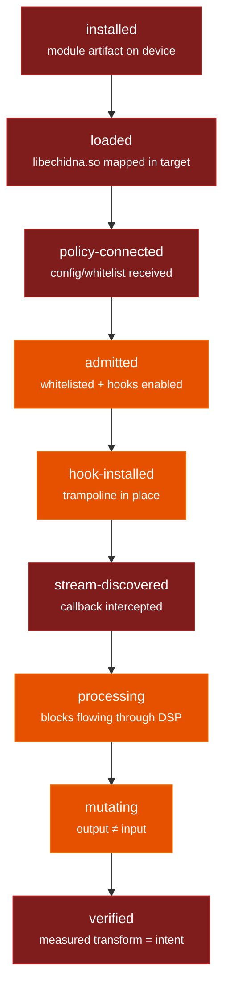

# Evidence & Observability State Model (§18)

**Scope of this document.** It defines every telemetry / evidence state Echidna
can represent on the host, states precisely what each one means, maps them to the
report §1 state ladder, and — following the report's prime directive
(*do not overstate proof*) — marks exactly which states are **honestly
unobservable on the host** and require a physical device / rooted-Zygisk
emulator to witness.

The governing rule the report demands and this model enforces:

> **Distinct real states must never be conflated.**
> *hooked ≠ mutated*; *block count ≠ mutation count*; *route-presence ≠
> route-use*; *a bypass is not a failure*; *an unchanged block is not a
> mutated block.*

---

## 1. Where evidence lives (three layers)

Echidna's observable state is split across three deliberately separate
mechanisms. Keeping them separate is what makes the non-conflation guarantees
above representable at all.

| Layer | Type | File | Represents |
| --- | --- | --- | --- |
| **Lifecycle status** | latched enum | `state/shared_state.h` `InternalStatus` | coarse per-process status: `kDisabled` / `kWaitingForAttach` / `kHooked` / `kError` |
| **Admission** | lock-free permit | `state/shared_state.{h,cpp}` `audio_processing_usage_` + `AudioProcessingPermit` | whether the realtime path is *policy-admitted* right now, with an in-flight drain refcount |
| **Per-route telemetry** | lock-free counters | `utils/telemetry_accumulator.{h,cpp}` | route-by-route *install level* + *processing/mutation/bypass/failure edges* |

The wire exporter (`runtime/telemetry_socket_exporter.cpp`, owned outside this
track) derives a single `state` string per route from the telemetry deltas and
serializes a subset of them — see §5 and Findings.

---

## 2. Telemetry counter semantics (the authoritative definitions)

`TelemetryAccumulator` holds one cache-line-isolated `Counters` block per
`TelemetryRoute`. A `take(route)` returns a `TelemetryDelta` and atomically
drains the **edge** counters; the **level** bit is reported but not cleared.

| Field | Kind | Meaning | Drained by `take()`? |
| --- | --- | --- | --- |
| `blocks` | edge | count of blocks **processed** on this route (route-*use*) | yes |
| `frames` | edge | frames seen across all outcomes (wraps mod 2³²) | yes |
| `mutations` | edge | blocks whose output actually **differed** from input | yes |
| `bypasses` | edge | blocks **admitted but deliberately not processed** | yes |
| `failures` | edge | **block-processing** failures only — a block could not be processed (original audio preserved). Never inflated by a failed install. | yes |
| `install_events` | edge | hook install/attach *transitions* recorded | yes |
| `install_failures` | edge | hook **attach/install** failures — kept separate from block `failures` so "route never attached" ≠ "a block failed to process" | yes |
| `installed` | **level** | current hook/install presence (route-*presence*) | **no** — latched |
| *unchanged* | derived | `blocks − mutations − bypasses − failures` | — |

Key structural facts (locked by `tests/telemetry_accumulator_test.cpp`):

- **`installed` is a latched level, not an edge.** Two consecutive `take()`s
  report `installed == true` both times, but `install_events` is non-zero only
  on the first. *Route-presence persists; route-use drains.*
- **An installed route with no new use is not `pending()`.** The level alone
  never triggers an export — presence does not masquerade as use.
- **The four block outcomes partition `blocks` exactly.** Every processed block
  increments `blocks` and `frames`, then bumps **exactly one** of
  {`mutations`, `bypasses`, `failures`} or none (unchanged). Therefore
  `mutations + bypasses + failures + unchanged == blocks` always.
- **Recording is realtime-safe.** `recordBlock` / `recordInstall` use only
  lock-free relaxed atomics — no allocation, no lock, no logging, no syscall.
  20 000 mixed records + drains allocate zero bytes in the test.
- **Telemetry never stores PCM.** `recordBlock` takes a frame *count*
  (`uint32_t`), never a sample pointer. The accumulator's footprint is a fixed
  `64 · kCount`-byte counter array; it cannot grow with traffic and structurally
  cannot retain audio content.

---

## 3. The four block outcomes (`TelemetryBlockOutcome`)

| Outcome | Set when | Audio effect | Not to be confused with |
| --- | --- | --- | --- |
| `kUnchanged` | processed, output bit-equal to input | none audible | a *bypass* (unchanged was still processed) |
| `kMutated` | processed, output ≠ input | audio actually altered | merely being *hooked* / *installed* |
| `kBypassed` | admitted but intentionally skipped (bypass timer / policy) | passthrough | a *failure* (bypass is intentional) |
| `kFailure` | block could not be processed; original preserved | passthrough | a *mutation* or a *bypass* |

The classification is produced at the DSP boundary (`api.cpp
echidna_process_block` / `echidna_stream_process`) by comparing output against
input (`LevelStats.changed` / the stream registry's `mutated` flag), **not**
inferred from the fact that a hook fired. This is the concrete mechanism behind
*hooked ≠ mutated*: a hook can run, process a block, and legitimately report
`kUnchanged`.

---

## 4. Mapping to the report §1 state ladder

The report's §1 ladder ascends from *installed* to *verified*. Each rung maps to
a specific evidence source, and each is honestly labelled by whether it is
**observable on the host** (unit/CTest, no device) or **device-gated**.

| §1 ladder rung | Meaning | Represented by | Host-observable? |
| --- | --- | --- | --- |
| **installed** | module artifact present on device | Magisk module + `install_events`/`installed` on first attach | ❌ device-gated (module load) |
| **loaded** | `libechidna.so` mapped into a target process | Zygisk `postAppSpecialize` attach; `InternalStatus` leaves `kDisabled` | ❌ device-gated |
| **policy-connected** | process received controller config (whitelist/preset) | `SharedState::updateConfiguration` from shared memory / profile-sync | ❌ device-gated (IPC + SELinux) |
| **admitted** | this process is whitelisted **and** hooks enabled | `SharedState::audioProcessingAllowed()` / `AudioProcessingPermit` | ⚠️ logic host-testable; live admission device-gated |
| **hook-installed** | a capture hook trampoline is in place for a route | `recordInstall(route, true)` → `installed` level | ⚠️ recording host-testable; real trampoline device-gated |
| **stream-discovered** | an audio stream/callback was intercepted | `blocks > 0` for the route | ❌ device-gated (needs live audio) |
| **processing** | blocks are flowing through the DSP | `blocks > 0`, exporter `state = "processing"` when `mutations > 0` | ⚠️ mechanism host-testable; live flow device-gated |
| **mutating** | output actually differs from input | `mutations > 0` | ⚠️ classification host-testable; live mutation device-gated |
| **verified** | measured transform matches intent end-to-end | *no single flag* — requires FFT/measurement on device | ❌ device-gated |

**How to read the ⚠️ rows.** The *ability to represent and record* the state is
proven host-side (the counters exist, are independent, and behave correctly —
locked by the test). What is **not** provable host-side is that the state was
actually reached against real Android audio: that a real AAudio callback fired,
that a real trampoline was installed, that a real app's stream was discovered.
Those require a device and are covered by `docs/verification.md` /
`docs/hardening/rt-safety.md` and the t4 on-device logs — **not** by this track.

The same ladder as a diagram — green rungs are witnessable in host CTest, amber
rungs have host-testable *mechanism* but device-gated *reality*, red rungs need a
physical device / rooted-Zygisk to observe at all:



*Amber (`admitted`, `hook-installed`, `processing`, `mutating`): the counters and
classification exist and are host-tested; the live event they represent is
device-gated. Red (`installed`, `loaded`, `policy-connected`,
`stream-discovered`, `verified`): unobservable without a device.* No rung is
painted green here because even the host-representable rungs still require a real
Android process to be *reached* — the honest reading of §6.

---

## 5. What the wire actually carries

`telemetry_socket_exporter.cpp` collapses a route's delta to one `state` string:

```
mutations != 0 -> "processing"
bypasses  != 0 -> "bypassed"
failures  != 0 -> "error"
otherwise      -> "installed"
```

Since the **schema-v3** evolution (t8-e2), `EncodeTelemetry` serializes the full
non-conflation set, not just the four v2 fields:

| Wire location | Fields | Since |
| --- | --- | --- |
| `deltas` (edges) | `blocks`, `frames`, `failures`, `mutations` | v2 |
| `deltas` (edges) | `bypasses`, `installEvents`, `installFailures` | **v3** |
| `root` (level) | `installed` | **v3** |

v3 is a strict **superset** of v2: no v2 key was renamed or dropped, three delta
edges and the latched install level were *added*, and `schemaVersion` is `3`. The
`state` precedence above is unchanged. This closes the wire-layer gap that finding
**F2** (below) reported: *a bypass is not a failure / not an unchanged block* and
*route-presence ≠ route-use* are now representable **on the wire**, not only in
the accumulator. The controller's strict validator was **not** weakened to allow
this — see §7-F2 for how the schema bump kept the exact-key-set check intact.

---

## 6. Honestly unobservable on the host (device-gated)

These cannot be witnessed by any host unit test and must not be claimed as
"done" from CTest alone:

- **Real module install / load / specialization** into an Android process
  (Zygisk `postAppSpecialize`). Host tests exercise the *accumulator*, not the
  Android loader.
- **Real hook trampoline installation** for any capture route (AAudio, OpenSL,
  AudioFlinger, AudioRecord, libc `read`, tinyalsa). `recordInstall` recording
  is host-tested; the actual inline-hook success is device/ABI-gated.
- **Stream discovery / live block flow** — requires a real app producing audio;
  `blocks > 0` is only meaningful on-device.
- **End-to-end "verified" transform** (e.g. the −7-semitone pitch measurement)
  requires on-device capture + FFT; see t4 logs and `docs/verification.md`.
- **Policy propagation under enforcing SELinux** to hooked apps.

The in-app Diagnostics screen makes this honesty visible rather than faking
activity. On an unrooted device with no native engine, every telemetry-derived
value rests at its empty state — there is nothing to accumulate:


*Honest by design: **Engine Not Installed**, XRuns 0, metrics at −120 dBFS, "No
latency data yet". None of the ⚠️/❌ rungs in §4 have been reached, so the
counters are legitimately zero — the surface reports absence, not a fabricated
"processing" state.*

---

## 7. Findings

This track (t6-e4) reported both findings below rather than applying wire-visible
changes itself. F1 was subsequently **landed by t6-e8**; F2 was **landed by
t8-e2** (schema-v3). Both are now closed.

### F1 — install failure was folded into the block `failures` counter — LANDED (t6-e8) ✅
*Original finding:* `TelemetryAccumulator::recordInstall(route, /*success=*/false)`
incremented the same `failures` counter used for audio-**block** processing
failures, so a consumer (and the exporter's `StateFor → "error"`) could not
distinguish *"the route failed to install"* from *"a block failed to process."*

**Resolution (landed).** t6-e8 added a dedicated `install_failures` edge counter
to `Counters` / `TelemetryDelta` (`telemetry_accumulator.{h,cpp}`).
`recordInstall(false)` now increments *only* `install_failures`; the block
`failures` counter is never inflated by a failed install. `install_failures` is
a proper edge — drained by `take()`, summed by `merge()`, reset by `clear()`,
and included in `pending()`. Install-failure and block-failure are now
independently observable, so the last residual conflation inside the accumulator
is closed. `tests/telemetry_accumulator_test.cpp` Section D was rewritten to lock
the **separated** semantics (a failed install bumps `install_failures`, leaves
block `failures` at zero, and does not latch `installed`).

### F2 — exporter dropped `bypasses` / `installed` / `install_events` at the wire — LANDED (t8-e2) ✅
*Original finding:* the v2 `EncodeTelemetryV2` serialized only
`{blocks, frames, failures, mutations}`, and `StateFor` returned the literal
`"installed"` as a *fallback* without reading the `installed` bool. Consequences:
- downstream could not separate **bypassed** from **unchanged** (bypasses absent
  from the wire), weakening *a bypass is not a failure / not an unchanged block*
  at the wire layer;
- the latched install **level** never reached the controller, so
  *route-presence* was invisible off-device except as the fallback string.

The obstacle was correctly identified as a **security constraint, not a bug to
paper over**: the controller's `AuthenticatedTelemetry.kt` runs a **strict
exact-key-set validator** (a §13 hardening control) that rejects *every* frame
carrying an unexpected key. Appending fields to the v2 frame would have made the
validator reject all telemetry. Widening the field set therefore required a
**coordinated, validator-aware schema bump**, not a loosened check.

**Resolution (landed).** t8-e2 landed **schema-v3** as a strict superset of v2
(see §5): native `EncodeTelemetry` emits v3 (`deltas` gains `bypasses` /
`installEvents` / `installFailures`; `root` gains `installed`; `schemaVersion` 3).
`AuthenticatedTelemetry.kt` now accepts **both** v2 and v3, each validated against
its **own** strict key-set — the `schemaVersion` range widened to `2..3`, and
unknown/mixed keys are still rejected, with peer-cred, published-identity, and
seq/gen anti-replay untouched. The fields thread through frame/store/`baseJson`
and the app-side Diagnostics surface reads them (`TelemetryParser.kt`,
`AdvancedDiagnosticsSection.kt`). **The strict validator was not weakened.**
Verified by GATE-3 (`telemetry_socket_exporter_test` asserting the v3 key set,
`AuthenticatedTelemetryTest` unknown-key / mixed-key / replay / `schemaVersion`
-bound cases, app `AuthenticatedTelemetryParsingTest`). See
[checklist §18-F2](checklist.md#18-observability-without-damaging-the-audio-path)
and [threat-model §3.2](threat-model.md#32-evidence-telemetry-integrity).

### Note — local CRLF on `state/shared_state.{h,cpp}`
The working-tree copies carry CRLF from `core.autocrlf=true`; the **committed
blobs are LF and clang-format-18 clean**, so CI/GATE-1 (LF) are unaffected. No
change made.

---

## 8. Test coverage map (`tests/telemetry_accumulator_test.cpp`)

| Section | Locks |
| --- | --- |
| A | four outcomes independent; `unchanged` is the exact derived remainder; block count ≠ mutation |
| B | *hooked ≠ mutated* both directions (install ⇏ block; mutation ⇏ install) |
| C | `installed` level persists across `take()`; edges drain; presence ≠ pending |
| D | install-failure signals: `!installed`, one install event, `install_failures` bumped, block `failures` untouched (F1 separated semantics, landed t6-e8) |
| E | per-route isolation (no cross-contamination) |
| F | realtime safety: zero allocation under load, lock-free, fixed PCM-free footprint |
| G | `merge()` coalescing: level last-wins, event edges summed |
