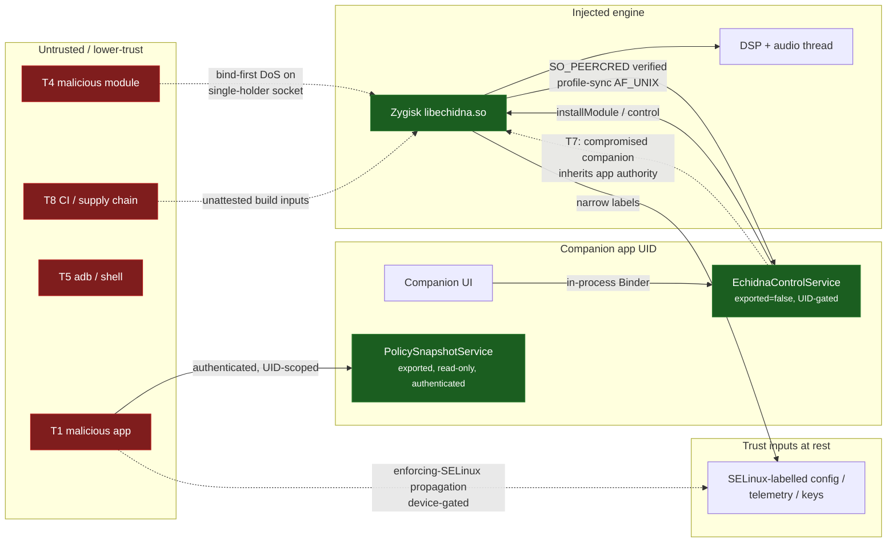

# Threat Model (report §13)

This is Echidna's consolidated formal threat model. The security controls a
threat model demands were built into the system as hardening features across
prior work (t2/t4/t6); until now they lived only as scattered code and
per-section checklist rows. This page enumerates them as one artifact: the
**assets** worth protecting, the **threat actors** who might attack them, the
**trust boundaries** they cross, and — for each boundary — the **control that
exists today** versus the **residual or open risk**.

!!! warning "Honesty directive (from the hardening report)"
    Every control marked **Implemented** cites a real file. Every **Open** or
    **Device-gated** item says what is still missing and where it would be
    proven. **No external security review or penetration test has been performed
    on Echidna.** This is a self-assessment by the engineering work; it is not an
    audit, and "Implemented" means "the code is present and host-tested," not
    "independently verified secure." Anything provable only on a physical device
    or rooted-emulator-with-working-Zygisk is **Device-gated** and is not claimed
    done — see [Verification](../verification.md) and the
    [Checklist](checklist.md).

## Status vocabulary

| Status | Meaning |
| --- | --- |
| **Implemented** | Control exists in the tree and is host-testable/tested. Cites a file. |
| **Partial** | A real control exists but does not fully cover the boundary; the gap is named. |
| **Open** | Landable control not yet built; the concrete next step is named. |
| **Device-gated** | Real, but the control's *effect* can only be proven on a device / rooted-Zygisk / OEM HAL. |

---

## 1. Assets

What an attacker would want to read, forge, or corrupt, ordered roughly by
sensitivity.

| # | Asset | Where it lives | Why it matters |
| --- | --- | --- | --- |
| A1 | **Captured PCM audio** (the user's live microphone stream) | in-process capture buffers on the audio thread; never persisted | The whole point of the tool; leaking it is a privacy breach. Telemetry is designed to **never** retain it (frame *counts* only — `utils/telemetry_accumulator.h`, [evidence-state-model §2](evidence-state-model.md)). |
| A2 | **Capability / signing keys** | Ed25519 plugin-trust key (build-time `ECHIDNA_TRUSTED_PLUGIN_PUBKEY`, `native/dsp/src/plugins/plugin_loader.cpp`); controller SPKI (`echidna_controller_spki_file`, `magisk/sepolicy.rule`); APK release keystore (`keystore.properties`, never committed — `docs/signing.md`) | Forging any of these lets an attacker load untrusted DSP code, impersonate the controller, or ship a trojaned build. |
| A3 | **Telemetry HMAC key** | per-install `echidna_telemetry_key_file` (root:audio 0440, `magisk/sepolicy.rule`); consumed by `native/effects/legacy/telemetry_protocol.cpp` | Forging it lets a process fabricate "processing/mutating" evidence or spoof another route's telemetry. |
| A4 | **Policy v2 state** — profiles, active preset, whitelist, `captureOwners`, control state, monotonic service generation | published by the service, decoded in `native/zygisk/src/runtime/profile_sync_server.cpp`, `PublishedPolicyRegistry.kt` | Corrupting it flips who gets captured (whitelist), what transform runs, or whether the engine is admitted at all. |
| A5 | **Presets** (DSP effect chains + params) | `PresetSerializer.kt` / on-disk store; applied via `echidna_set_profile` | Malformed presets are an untrusted parser input into the native engine. |
| A6 | **Module / DSP / shim binaries** | `libechidna.so`, `libech_dsp.so`, LSPosed shim, packaged per-ABI in the Magisk zip | The code that runs at highest privilege (Zygisk-injected into every hooked app). Tampering = arbitrary code in target apps. |
| A7 | **Diagnostics export** | in-app Diagnostics → Export; `AuthenticatedTelemetrySnapshot.toDiagnosticsJson` anonymizes (drops uid/pid/process) | A support artifact that must not leak identities or PCM. |
| A8 | **On-device trust inputs** at rest | `/data/adb/modules/echidna/...`, config/telemetry regions under `/data/local/tmp/echidna` | Their SELinux labels are the last line between a hooked app and the controller's authority. |

---

## 2. Threat actors

| # | Actor | Capability assumed | Primary goal |
| --- | --- | --- | --- |
| T1 | **Malicious ordinary app** | unprivileged, same device | Reach the config/telemetry regions or the policy socket; forge telemetry; get itself whitelisted or capture another app. |
| T2 | **Compromised whitelisted target** | code exec inside an app Echidna *does* hook | Abuse the in-process hook/DSP surface; exfiltrate its own captured PCM through telemetry. |
| T3 | **Shared-UID app** | shares a UID with a legitimate peer | Pass a UID-only check while not being the real publisher/caller. |
| T4 | **Malicious LSPosed / Magisk module** | runs in the same Zygisk/Xposed space | Impersonate the controller's socket; race the profile-sync single-holder socket; feed forged policy. |
| T5 | **Local shell (adb) / non-root** | `shell` UID | Read/write `/data/local/tmp` (it is `shell_data_file`); poke exported components. |
| T6 | **Root / another root module** | full device root | Out of scope for *confidentiality* (root wins) — but Echidna should still **fail closed**, not silently trust. |
| T7 | **Compromised companion app** | code exec in the Echidna UI app | Drive the AIDL/Binder surface, including the new in-app installer. |
| T8 | **Compromised CI / supply chain** | can alter build inputs | Inject a backdoored `.so`, swap the plugin key, or weaken the signing gate. |
| T9 | **Vendor audio process** (`audioserver` / `hal_audio_server`) | the delegated-capture boundary | The AudioFlinger/HAL side that legitimately needs the effect keys — and a boundary an OEM bug could turn hostile. |
| T10 | **Hook-probing app** | tries to detect/subvert the inline hook | Discover the trampoline, feed it hostile buffers, or crash the audio path. |
| T11 | **Network attacker on diagnostics** | can intercept an exported diagnostics artifact | Read identities/PCM if the export were not sanitized. |

---

## 3. Trust boundaries

Each row is one boundary a request or artifact crosses, the **existing control**
(with the file it lives in), and the **residual / open risk**. The map below
places the actors (T1–T10) against the boundaries they cross; solid edges are
authenticated/controlled paths, dashed edges are the residual/DoS surfaces called
out in the tables:

*Dashed edges are this model's honest residuals: the compromised-companion
inheritance (§3.1/§3.4), the profile-sync single-holder DoS (§3.1), device-gated
enforcing-SELinux propagation (§3.1), and unattested supply chain (§3.4).*

### 3.1 On-device IPC and policy

| Boundary | Actors | Existing control | File(s) | Residual / open | Status |
| --- | --- | --- | --- | --- | --- |
| **UI app ↔ control service (Binder/AIDL)** | T7 | `EchidnaControlService` runs behind `safeBinder` fail-closed wrappers; privileged setters gate `Binder.getCallingUid() == applicationInfo.uid`; the AIDL is single-canonical | `EchidnaControlService.kt` (:336/:343 uid gate; :455 `safeBinder`) | Not every AIDL method is UID-pinned — most rely on the service not being exported broadly; a compromised companion (T7) inherits the app's authority by design. New installer methods widen this surface (see §3.4). | Partial |
| **Exported policy provider ↔ Binder caller** | T1, T3, T5 | Read-only, authenticated: caller's claimed process must resolve to a package **owned by the caller's UID**; policy is scoped to the caller's packages before return | `CallerPolicyAuthorizer.kt` (package ∈ `packagesForUid`), `PublishedPolicyRegistry.kt` (`authorizeProcess`, `scopedForPackages`), `PublishedAppIdentity.kt` | Confidentiality rests on `packagesForUid` correctness; a shared-UID app (T3) can read policy scoped to any package it co-owns. Acceptable (same UID = same trust domain). | Implemented |
| **Zygisk client ↔ profile-sync publisher (AF_UNIX)** | T1, T4 | Abstract socket **namespaced per expected UID**; client verifies publisher via `SO_PEERCRED` UID match before sending hello; strict process-name grammar; framed length caps; malformed/rollback/same-gen-conflict policy **rejected**; disconnect → fail-closed admission revoke | `profile_sync_server.cpp` (`IsTrustedPublisher` :94-112, `IsValidProcessName`, `EvaluateGeneration`, `revokeProcessAdmission`) | **Single-holder socket** (`/data/local/tmp/echidna_profiles.sock`, "last bind wins", per-process) — documented known limitation: don't run Zygisk + LSPosed shim together; with multiple hooked apps only the last binder receives pushes, others stay fail-closed. A malicious module (T4) that binds first can DoS delivery (not forge it — peer UID still checked). | Partial |
| **Controller ↔ hooked app config region** (enforcing SELinux) | T1, T2 | Dedicated `echidna_config_file` type, **app read-only**, writer stays root/service; region kept **off** `shell_data_file`; traverse-only grant on the parent | `magisk/sepolicy.rule` (:18-41) | Whether the label actually propagates and reaches hooked apps under *enforcing* SELinux is **unproven on-device** — t4 fell back to process-local memfd. This is the §14 device-gated gap. | Device-gated |
| **Hooked app → controller telemetry region** | T1, T2 | Dedicated `echidna_telemetry_file` type (app read-write, so each app publishes its own); label isolated from unrelated `/data/local/tmp` files | `magisk/sepolicy.rule` (:21-47) | A hooked app writes its **own** telemetry — forgery of *another* process's telemetry is blocked at the authenticated-telemetry layer (§3.2), not here. | Implemented |

### 3.2 Evidence / telemetry integrity

| Boundary | Actors | Existing control | File(s) | Residual / open | Status |
| --- | --- | --- | --- | --- | --- |
| **Telemetry producer ↔ verifier (wire)** | T1, T2, T10 | **Strict exact-key-set validator**: root + delta key sets must match exactly, `schemaVersion` accepted `2..3` (each version validated against its **own** exact key-set), RFC-8259 pre-validation, numeric range checks, process-name grammar, per-peer rate limit, TTL + generation + monotonic-sequence staleness; `processing` state must carry `mutations>0`+fresh mutation | `AuthenticatedTelemetry.kt` (`keysSet()==` per-version, `schemaVersion` `2..3`, `StrictJsonValidator`, `PeerTelemetryRateLimiter`, `AuthenticatedTelemetryStore`) | The validator is deliberately unforgiving — appending keys to a *given* version rejects **every** frame. §18-F2 (richer wire schema) landed as a **coordinated schema-v3 superset** (t8-e2), not a loosened check: v3 adds `bypasses`/`installEvents`/`installFailures`/`installed` and is validated against its own strict key-set. See [evidence-state-model §7-F2](evidence-state-model.md#7-findings). | Implemented |
| **Effect host ↔ telemetry-proof key** | T2, T9 | HMAC-SHA256 over the telemetry proof with **constant-time compare** (`CRYPTO_memcmp`); key is `echidna_telemetry_key_file` root:audio 0440, readable only by `audioserver`/`hal_audio_server` | `telemetry_protocol.cpp` (`HMAC(EVP_sha256())` :285, `ConstantTimeEqual`/`CRYPTO_memcmp` :100-105, verify :306/:317), `magisk/sepolicy.rule` (:24,:54-55) | Depends on the SELinux label restricting the key to audio hosts holding on-device (Device-gated for enforcing propagation). Constant-time compare mitigates timing oracles. | Implemented |
| **Capability signer ↔ effect / preprocessor** | T2, T4, T9 | ECDSA-over-SPKI capability verification (BoringSSL), bounded SPKI size, explicit authorize flag, time-bounded capability; controller SPKI on its own `echidna_controller_spki_file` type (0444) | `capability_protocol.cpp` (`kMaximumSpkiBytes`, verify path), `magisk/sepolicy.rule` (:26,:60-61) | The legacy-preprocessor **attach/enable** manager that would consume these capabilities is itself **Open** (§7 checklist); the crypto exists, the session-attach caller does not. | Partial |

### 3.3 Native code / capture-route surface

| Boundary | Actors | Existing control | File(s) | Residual / open | Status |
| --- | --- | --- | --- | --- | --- |
| **Zygisk ↔ DSP (audio thread)** | T2, T10 | DSP aliases the app-owned buffer safely; AAudio callback route runs into a **pre-faulted scratch**, never the platform-owned input (report P0 fix); **fail-open** on any DSP decline (original buffer preserved, never silence/partial); lock-free bounded admission | `hooks/aaudio_stream_registry.cpp` (`dispatchCallback`), [rt-safety.md](rt-safety.md) | libc `read` route's `fstat`+`readlink` classification now runs off the hot path via a per-fd verdict cache (t9); hot reads are a lock-free atomic lookup (opt-in `ECHIDNA_LIBC_*`) — [rt-safety FINDING-1](rt-safety.md#finding-1-libc-read-route-ran-fstat-readlink-on-the-hot-path-resolved-per-fd-verdict-cache-t9). Live trampoline install/timing is Device-gated. | Partial |
| **Plugin loader ↔ native plugin code** | T2, T8 | Ed25519 signature check before `dlopen`; trusted key from build-time compile-def; **all-zero fail-closed placeholder** when unprovisioned (rejects every third-party plugin rather than trusting an attacker key); `<strlen 64` guard | `plugin_loader.cpp` (`VerifyEd25519` :83, `kTrustedKeys`/placeholder :52-58) | The shipped placeholder is **all-zero by design** — a real trusted Ed25519 key must be provisioned before third-party plugins can ever load (checklist §21, `todo.md`). Until then, plugins are effectively disabled (fail-closed), which is safe. | Implemented (fail-closed) / Open (real key) |
| **Shim Java ↔ JNI DSP** | T2, T10 | Transactional Java reads (`AudioReadTransaction`): original `read()` result always preserved, exact region restored on native decline/exception/revocation; thread-local `RegionBackup` | LSPosed shim (`AudioReadTransaction`, `ByteBufferProcessor`), [rt-safety FINDING-2](rt-safety.md#finding-2-lsposed-java-path-is-not-hard-rt-heap-bytebuffer-branch-allocates-per-call-reported-by-design-device-gated) | Not hard-RT by design (reflection + ART GC); heap-`ByteBuffer` branch allocates per call. Fail-open is structurally sound. Live injection is Device-gated. | Partial (by design) |
| **Inline-hook backend ↔ target process** | T10 | Multi-ABI: aarch64 primary; x86_64 relocating trampoline with allow-listed length decoder that **fails closed on anything unrecognized**; armv7 backed by a host-proven ARM32/Thumb-2 prologue relocator (`runtime/armv7_instruction.h`) that fails closed per function; host decoder harness | `runtime/inline_hook.cpp` (t2-e11); Zygisk load fixes `extern "C"` (0817ef2) + API-v3 (f47be79) | x86_64 under real injection and armv7 on-hardware install/execution are Device-gated. | Partial |
| **Pre-specialization file reads** | T1, T5 | `packages.list` opened `O_RDONLY \| O_CLOEXEC \| O_NOFOLLOW`, metadata validated on the same fd so the privileged read cannot be symlink-redirected | `process_utils.cpp` (:133-136) | — | Implemented |

### 3.4 Installer, release, supply chain

| Boundary | Actors | Existing control | File(s) | Residual / open | Status |
| --- | --- | --- | --- | --- | --- |
| **In-app installer ↔ filesystem / root** | T7 | Guided install flow: detect Magisk/root → stage + install bundled/picked zip via `magisk --install-module` → unload-first (master-off + Magisk disable marker) → reboot prompt → confirm via status poll. Runs only with the user's root grant; fails closed when Magisk is absent. The new privileged AIDL setters (`installModule`/`uninstallModule`) stay **same-UID-only** — `EchidnaControlService` remains `exported="false"`, so they are no more reachable than the existing control commands. | `EchidnaControlService.kt` (installer methods, same UID gate as control commands), `ui/install/**`, `EngineModuleArchive`; GATE-3 security review | A compromised companion (T7) inherits the app's authority by design — the same residual as every control method (§3.1); the installer did **not** widen the Binder UID gate. Runtime signature verification of the bundled zip on-device is not claimed (see next row). | Implemented (t8-e1) |
| **Installer ↔ bundled module zip** | T8 | Deterministic Magisk zip with verified exact-file layout; single module id `echidna`; per-ABI payloads bound to trusted NDK outputs | `tools/build_magisk_module.sh`, `docs/magisk_release.md`, checklist §15 | Zip is only as trustworthy as the CI that built it (T8). Runtime signature verification of the bundled zip on-device is not claimed. | Partial |
| **Release workflow ↔ secrets** | T8 | Fail-closed signing preflight, pinned non-debug cert verification, temporary-keystore cleanup, tag/dispatch-gated publish; keystore never committed | `tools/check_release_signing.py`, `docs/signing.md`, checklist §21 | Provision a real trusted plugin key; enable R8 only after keep-rules proven (both `todo.md`). CI trust is assumed, not attested (no reproducible-build attestation / SLSA). | Partial |
| **Effect host ↔ trust inputs at rest (SELinux)** | T1, T9 | Narrow per-type labels: config (app RO), telemetry (app RW), telemetry-key (audio-host RO 0440), controller-SPKI (0444); no private-service offset staging; module verifier checks the read-only trust-input label lifecycle | `magisk/sepolicy.rule`, checklist §14 | Enforcing-SELinux propagation to hooked apps is Device-gated (§14). | Implemented (policy) / Device-gated (effect) |

---

## 4. STRIDE summary

A compact cross-check of the classic categories against the boundaries above.

| Category | Principal threat | Primary control | Status |
| --- | --- | --- | --- |
| **Spoofing** | forged publisher / forged Binder caller / forged telemetry producer | `SO_PEERCRED` UID match (`profile_sync_server.cpp`), `packagesForUid` caller check (`CallerPolicyAuthorizer.kt`), UID-keyed telemetry entries + strict validator (`AuthenticatedTelemetry.kt`) | Implemented; shared-UID (T3) accepted as same trust domain |
| **Tampering** | policy rollback, malformed preset/policy, buffer corruption on the audio thread | generation rollback/conflict rejection, strict decoders, fail-open DSP + P0 AAudio scratch-buffer fix | Implemented (host) / Device-gated (live) |
| **Repudiation** | fabricated "processing/mutating" evidence | processing-proof gated on verification source + fresh mutation + generation match; HMAC-authenticated effect telemetry | Implemented |
| **Information disclosure** | PCM or identity leak via telemetry/diagnostics | telemetry stores frame *counts* only (never PCM); diagnostics export drops uid/pid/process | Implemented |
| **Denial of service** | telemetry flood; single-holder socket contention | per-peer rate limiter; TTL/entry caps; **residual**: profile-sync single-holder socket (T4 can bind-first) | Partial |
| **Elevation of privilege** | untrusted plugin/effect code loaded at high privilege | Ed25519 plugin verify with fail-closed placeholder; capability ECDSA verify; O_NOFOLLOW privileged reads | Implemented (fail-closed) |

---

## 5. Residual & open risks (honest summary)

1. **No external security review.** This model is self-assessment. An independent
   audit / pentest has not happened.
2. **Profile-sync single-holder socket** (`profile_sync_server.cpp`) — a
   first-binding malicious module (T4) can deny policy delivery to later hooked
   apps; and Zygisk + LSPosed shim must not run together. Peer-UID check still
   prevents *forgery*; this is availability, not integrity. Proper fix = a
   serve-last-snapshot / world-readable published-snapshot redesign (native).
3. **All-zero plugin trust key placeholder** — correct fail-closed default, but a
   real Ed25519 key must be provisioned before third-party DSP plugins are usable
   (checklist §21).
4. **Enforcing-SELinux config propagation** to hooked apps is **Device-gated**
   (checklist §14); the labels exist, on-device propagation is unproven.
5. **libc `read` route RT residual** (`fstat`+`readlink` classification) — fixed on host
   in t9 via a per-fd verdict cache (off the hot path); opt-in only; on-device
   descriptor-reuse timing device-gated ([rt-safety FINDING-1](rt-safety.md#finding-1-libc-read-route-ran-fstat-readlink-on-the-hot-path-resolved-per-fd-verdict-cache-t9)).
6. **In-app installer AIDL surface** (t8-e1, landed) — the guided installer added
   privileged `installModule`/`uninstallModule` methods. These a compromised
   companion (T7) inherits, but they are **same-UID-only** (`EchidnaControlService`
   stays `exported="false"`) — the installer did **not** widen the Binder UID gate,
   and it fails closed without Magisk. Residual is the *existing* §3.1 one (a
   compromised companion has the app's authority), not a new external surface.
   On-device runtime signature verification of the bundled zip is still not
   claimed (§3.4).
7. **Supply-chain trust is assumed, not attested** — no reproducible-build
   attestation / provenance signing beyond the signing preflight (T8).

Follow-up candidates worth a task are flagged in the section summaries above and
in `todo.md`.

---

## Sources

Prior work: `.orchestration/state.md` (t2/t4/t6 outcomes), t4 on-device logs.
Controls cited inline to their real files. Companion docs:
[checklist](checklist.md) (§13 row), [rt-safety](rt-safety.md),
[evidence-state-model](evidence-state-model.md), [Verification](../verification.md),
`docs/signing.md`, `docs/magisk_release.md`. No claim here asserts on-device
verification that was not performed, and none asserts an external review that did
not happen.
</content>
