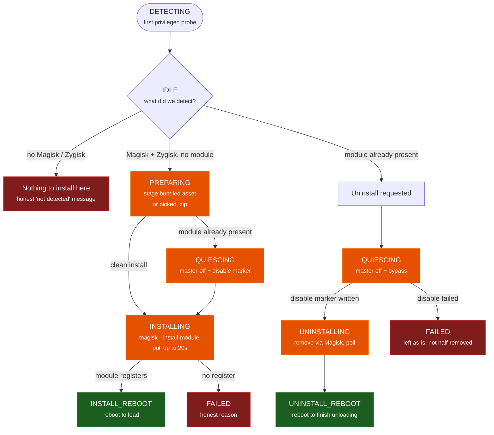

# Installer guide — the guided in-app engine installer

Echidna's on-device engine ships as a flashable Magisk/Zygisk module. You can always
flash it by hand (see [Magisk Release](magisk_release.md)), but the companion app also
carries a **guided installer** that detects your root setup, installs the module, does
the **unload-first** disable a live Zygisk module needs, and prompts the reboot that
actually loads or unloads it. This page walks through that flow and is honest about the
one thing it cannot do for you: prove the flash worked on your specific device.

!!! danger "This installs a root module — know your recovery path first"
    The installer flashes a **Magisk/Zygisk module that hooks the audio capture path**.
    It requires root with Magisk and Zygisk enabled, will not work on many phones even
    when it installs cleanly, and can bootloop a device. The installer's own risk card
    says exactly this before you proceed. Do not install unless you already know how to
    [recover from a bootloop](recovery.md) out-of-band.

## Where to start it

The installer is one screen (`AppDestination.InstallEngine`), reachable from several
honest entry points:

- **Settings → Install engine** (the button reads *"Install or update engine"* once a
  module is already present).
- **Dashboard** — the install call-to-action shown when no active engine is detected.
- **Alerts** — an advisory whose action target is the installer (for example, when the
  app notices Magisk but no installed module).

## The guided flow

The installer is driven by an explicit, honest state machine
(`InstallEngineViewModel`) — it never claims an "installed" or "active" state it has not
confirmed through the privileged status poll.

### 1. Detect

The screen opens on **DETECTING** — a spinner while the first privileged probe runs — and
settles into **IDLE**, showing the real device state: whether the control service is
connected, whether Magisk is detected, whether Zygisk is enabled, the engine summary, and
the SELinux mode. These come from the same `ModuleStatus` probe the rest of the app uses
(module id `echidna`, Zygisk via the Magisk settings DB); nothing here is fabricated.

The action offered depends on what was detected:

| Detected state | What the installer offers |
| --- | --- |
| Service not connected | *"The Echidna control service is not connected yet."* — no action |
| No Magisk / Zygisk | *"Magisk/Zygisk not detected … nothing will be installed on this device."* — no install |
| Magisk + Zygisk, no module | **Install engine module** |
| Module installed, Zygisk off | *"…enable Zygisk in Magisk to load it."* + **Open Magisk** |
| Module installed + Zygisk on | **Uninstall engine module** |

### 2. Install (from a bundled zip, or a picked one)

=== "Bundled zip (turnkey)"

    When the build ships a bundled `echidna-magisk.zip` asset, **Install engine module**
    stages it directly — no file picking. This is the turnkey path: one tap from a rooted
    device with Magisk and Zygisk.

=== "Pick a .zip (fallback)"

    When no module is bundled, the installer says so honestly — *"No engine package is
    bundled in this build. Select the Echidna Magisk module .zip to continue."* — and
    **Select module .zip instead** opens the system document picker so you can point it at
    a release `echidna-magisk-<tag>.zip`.

Staging happens in the **PREPARING** phase. If a module is **already present**, the
installer does **not** blindly overwrite it: because a live Zygisk module can't be
hot-swapped, it first **QUIESCES** — master-off + bypass so the engine stops mutating
audio, then writes the Magisk disable marker so Zygisk stops loading the old copy — and
only then installs the replacement. The install itself (`magisk --install-module`) runs in
the **INSTALLING** phase, and the installer **polls the privileged status for up to 20 s**
for the module to register rather than assuming success.

### 3. Reboot to load

A Zygisk module only loads at boot; it can't be injected into running processes. So a
successful install lands on **INSTALL_REBOOT**:

> "Module installed. A reboot is required to load the engine because a live Zygisk module
> can't be hot-swapped. Reboot, then reopen Echidna."

**Reboot now** attempts a best-effort privileged reboot. If that can't be dispatched, the
installer is honest and tells you to reboot manually — it does not pretend it restarted the
device.

### Uninstall (unload-first)

Removal follows the same unload-first discipline in reverse:

1. **QUIESCING** — master-off + bypass so the engine stops mutating audio immediately.
2. **Disable marker** — written so Zygisk stops loading the module next boot. If this step
   fails, the flow **aborts** with the module left *as-is* rather than half-removed:
   *"Couldn't disable the engine module … the module was left as-is rather than
   half-removed."*
3. **UNINSTALLING** — remove via Magisk, poll for the module to disappear.
4. **UNINSTALL_REBOOT** — reboot to finish unloading, because a live Zygisk module stays in
   running processes until the device restarts.

## The honest device-gated last mile

!!! warning "The installer drives the flow; the flash is still device-gated"
    Everything above — detection, staging, the unload-first disable, the reboot prompt,
    the status-poll confirmation — is real and testable. The **actual module flash** is
    the part that needs genuine root and a working Magisk. On a rooted emulator,
    `magisk --install-module` returned *Incomplete Magisk install*; that last mile is
    **device-gated** and not proven here. A clean run of this installer confirms the
    module *registered*, not that the audio hooks transform audio on your phone — that
    remains covered by [Verification](verification.md).

!!! tip "Magisk is hidden or repackaged?"
    **Open Magisk** launches the Magisk manager (stock, Delta/Kitsune, Alpha, or debug
    packages). If Magisk has been **hidden / stub-repackaged** under a random package
    name (a common anti-detection setup), there is no reliable non-privileged way to find
    it, so the installer says so — *"Couldn't open Magisk automatically. If Magisk is
    hidden or repackaged, open it manually…"* — rather than pretending it launched
    something.

## See also

- [Release Packages](release-packages.md) — what each release asset is, and why the
  convenience bundles cannot be fetched in-app.
- [Magisk Release](magisk_release.md) — the authoritative manual flash path and packaging.
- [Troubleshooting & FAQ](troubleshooting-faq.md) — unload-first + reboot-required, *Engine
  Not Installed* on unrooted devices, and more.
- [Recovering from a bootloop](recovery.md) — the recovery ladder if a flash goes wrong.
- [Verification](verification.md) — what is proven on-device vs. host-only.
