# Screenshots

This gallery is a visual, honest tour of the Echidna companion app: the first-run
setup wizard, every main screen, and the new flows (in-app Help, the Lab
local-DSP testbench, theming, alerts, widgets and the Quick Settings tile).

!!! info "Capture environment (so the states are reproducible)"
    All shots below were taken from a freshly built debug APK on an **unrooted
    Android 14 (API 34) x86_64 emulator** at 1080 x 2400, via
    `adb exec-out screencap`. The emulator carries only a **non-functional Magisk
    stub (Zygisk disabled, no module installed)**, so every engine/root state
    honestly reads **Engine Not Installed**. The **Lab** DSP engine
    (`libech_dsp.so`) was compiled and packaged, so the Lab runs the **real
    in-process transform** — that path needs no root. PNGs are palette-optimised
    and committed (each well under 200 KB).

!!! warning "Honest state — what an unrooted capture can and cannot show"
    On this device the native engine is **not installed** and there is no working
    Magisk/Zygisk. So: the Dashboard and Diagnostics report **Engine Not
    Installed**, the Compatibility Wizard reports **Magisk/Zygisk unusable and
    `su` denied**, the Quick Settings tile shows **Unavailable**, and the meters
    rest idle. The **Lab** screens are the exception — they are a **local
    microphone + test-tone DSP proof running inside this app's own process**. They
    demonstrate that the DSP transform itself works; they are **not** interception
    of any other app's audio, and they are **not** evidence of Magisk flashing or
    LSPosed injection. Runtime proof of the native engine on a rooted device lives
    in [Verification](verification.md).

## First-run setup wizard

The 13-step wizard runs on first launch and is re-runnable from **Settings ->
Run setup again**. Every step is skippable with a sane default, except the
recovery acknowledgement.

### Welcome

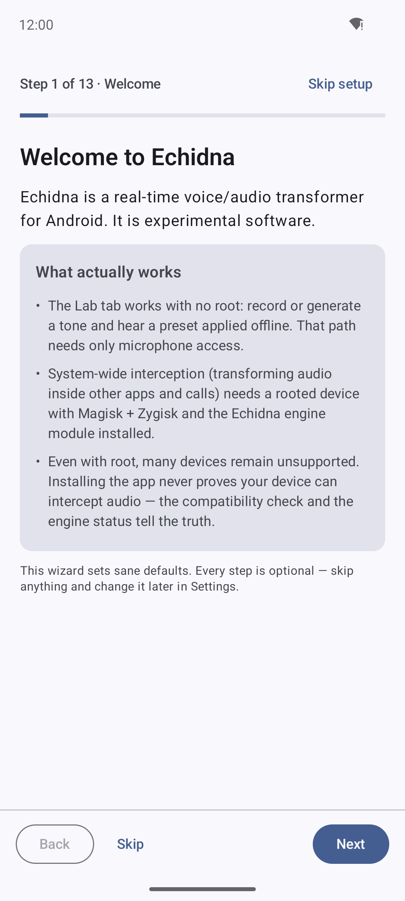

Step 1 sets honest expectations up front: the **Lab tab works with no root**;
system-wide interception needs a **rooted device with Magisk + Zygisk and the
engine module**; and **installing the app never proves** your device can
intercept audio — the compatibility check and engine status tell the truth.

### Permissions

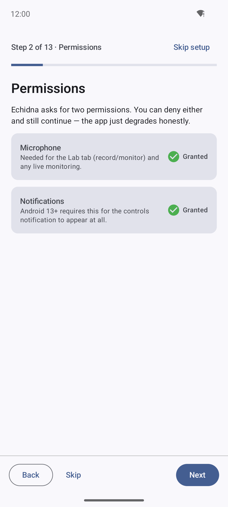

Step 2 requests **Microphone** (for the Lab and recording) and **Notifications**
(for the controls notification). Either can be denied; the app degrades honestly.

### Recovery acknowledgement (the one gated step)

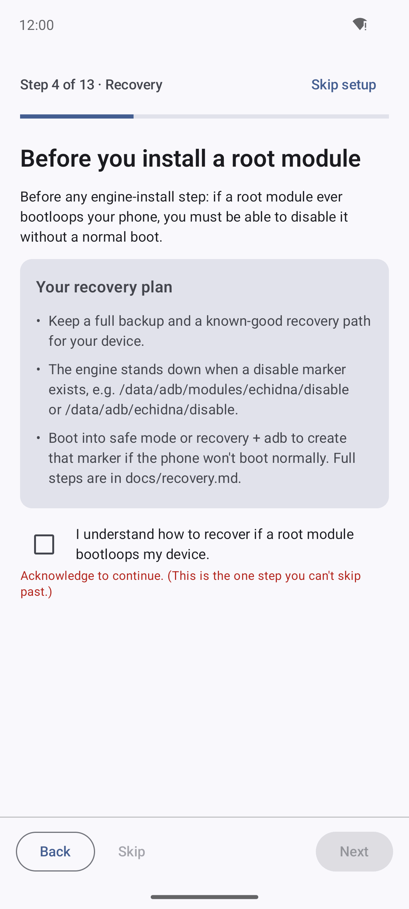

Step 4 is the **only step you cannot skip**. Before any engine-install flow, you
must tick *"I understand how to recover if a root module bootloops my device."*
**Next stays disabled** until you do. It points at the disable marker
(`/data/adb/modules/echidna/disable`) and [recovery.md](recovery.md).

### Interception engine

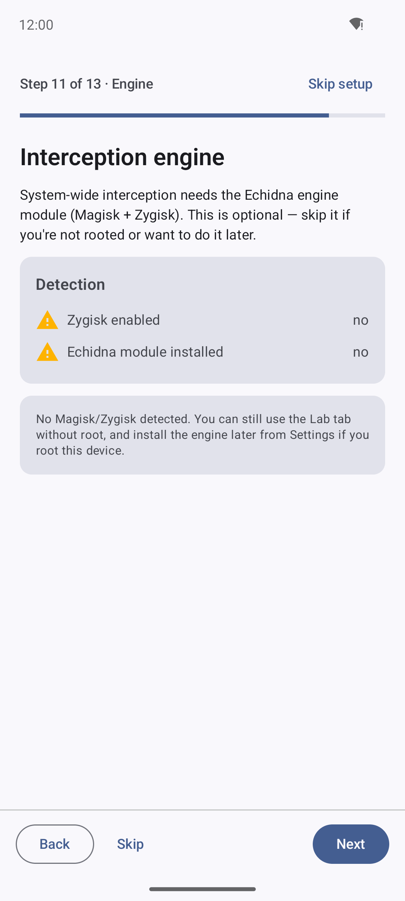

Step 11 is honest about system-wide interception: detection shows **Zygisk
enabled — no** and **Echidna module installed — no**, and the copy confirms you
can still use the Lab without root and install the engine later if you root the
device. Nothing here claims an install succeeded.

### Hear it work

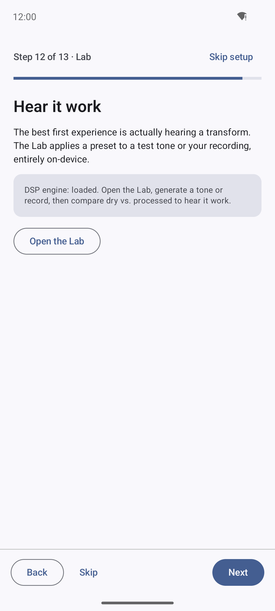

Step 12 points at the Lab — the real first experience. It reads **DSP engine:
loaded** and offers **Open the Lab** to generate a tone or record and compare dry
vs. processed, entirely on-device.

### You're set up

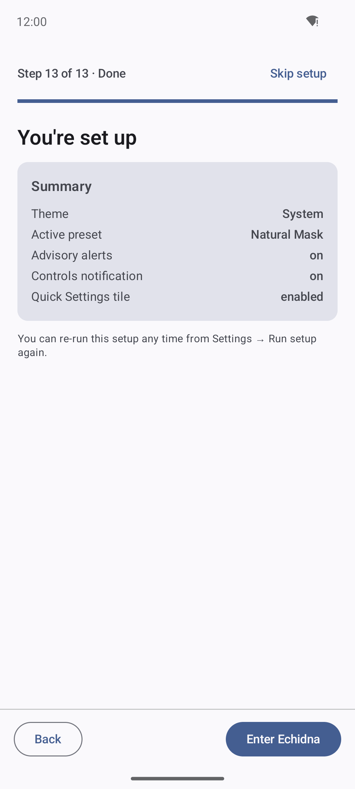

The finish step summarises the choices (theme, active preset, alerts, controls
notification, Quick Settings tile) and hands off with **Enter Echidna**.

## Dashboard

The app entry screen. The **Voice processing** master toggle is on, but the
engine status card reads **Engine not installed / NOT INSTALLED** ("Install the
Magisk module to enable voice processing · SELinux Enforcing"), and the meters
sit **IDLE**. A red **root-module / install-risk** banner is shown by design.

## Presets and effects

### Preset Manager

Eight built-in presets with Import / Export / New Preset and search. **Natural
Mask** is **ACTIVE** and **DEFAULT** (Low-Latency, 70% wet, 7 effects on); Darth
Vader sits below with an Activate action.

### Effects chain

The full seven-stage chain for the active preset: Noise Gate, Equalizer,
Compressor / AGC, Pitch Shift, Formant, Reverb and Dry/Wet Mix, each with a
bypass switch and a plain-language description.

### Pitch and formant

The signature Pitch Shift stage expanded: a **Semitones** slider (-12..+12) and a
**Fine cents** slider, with the "12 semitones = one octave" helper.

## The Lab — local DSP test (real transform, not interception)

### Local DSP testbench

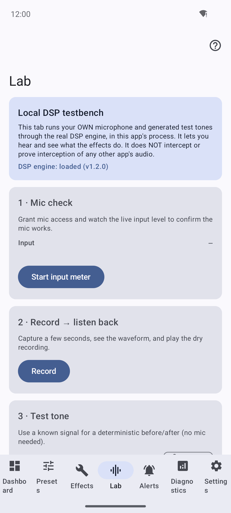

The Lab runs **your own microphone and generated test tones through the real DSP
engine, in this app's process** — it reads **DSP engine: loaded (v1.2.0)**. Its
own copy states plainly that it **does NOT intercept or prove interception of any
other app's audio**.

### Test tone A/B — the real transform

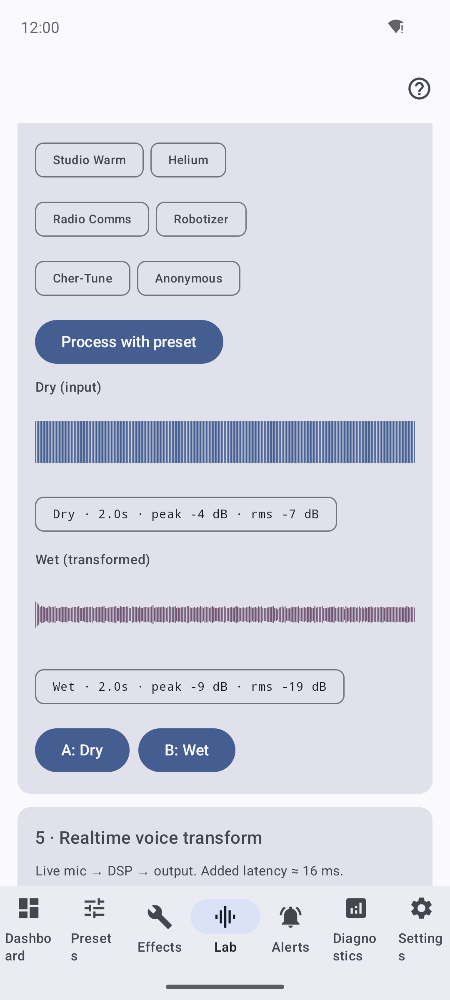

A generated **440 Hz sine** (Dry: peak -4 dB, rms -7 dB) processed through the
Darth Vader preset on the real engine gives a visibly different **Wet** waveform
(peak -9 dB, rms -19 dB), with **A: Dry** / **B: Wet** playback. This is honest
local-DSP proof that the transform works — **not** another app's audio.

## In-app Help and Docs

### Help browser

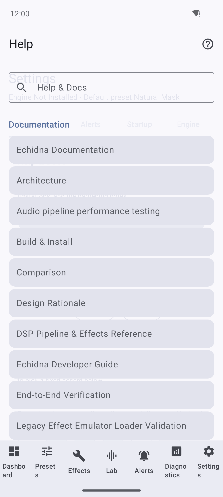

The Help tab renders the repository's own Markdown docs **offline** — a scrollable
list (Architecture, Build & Install, Verification, the hardening notes, and more).

### Full-text search

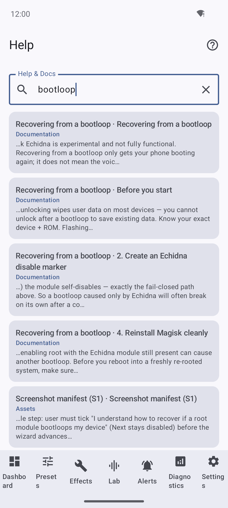

Native offline full-text search. Querying **"bootloop"** returns ranked
section-level matches with snippets (Recovering from a bootloop; Reinstall Magisk
cleanly; the Magisk-release failsafe contract).

## Theming

### Light

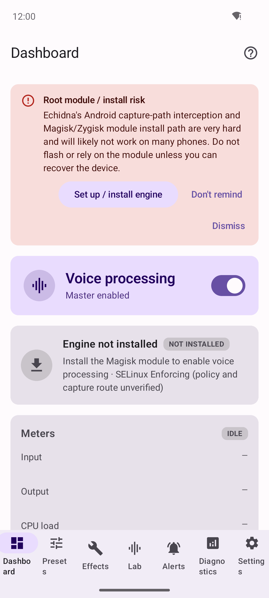

### Dark

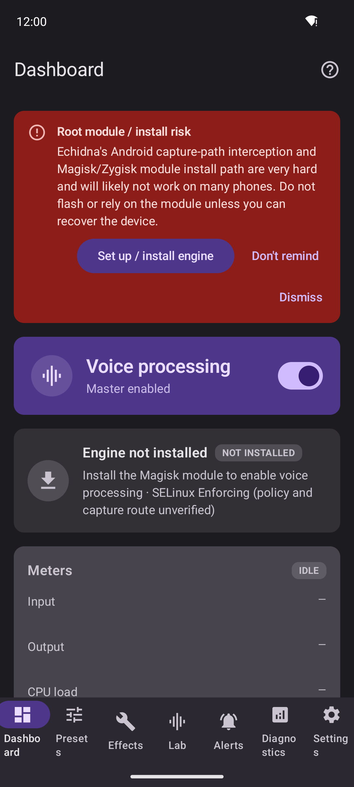

Light and Dark force the app's scheme regardless of the system; **System** follows
the device. The two shots above are the same Dashboard under each mode.

### Accent / Material You

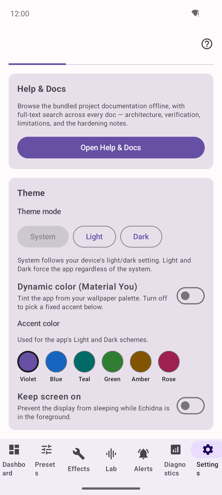

With **Dynamic color (Material You)** off, a fixed accent can be chosen from
Violet / Blue / Teal / Green / Amber / Rose; with it on, the app tints from the
wallpaper palette.

## Alerts

### Advisory alerts

Live advisories about install, bridge, hook-scope and hardware conditions. Each
card can be **dismissed** or permanently silenced with **Don't remind**. Here:
*Magisk module not detected*, *Native engine is not installed*, *No target apps
are whitelisted* — all honest for an unrooted device.

### Actionable alerts

Advisories carry **actions** that jump to the relevant screen — *Open Whitelist*,
*Open Magisk*, *Run wizard* — plus an honest control-bridge error
("unable to verify module installation: Permission denied").

## Diagnostics

### Overview

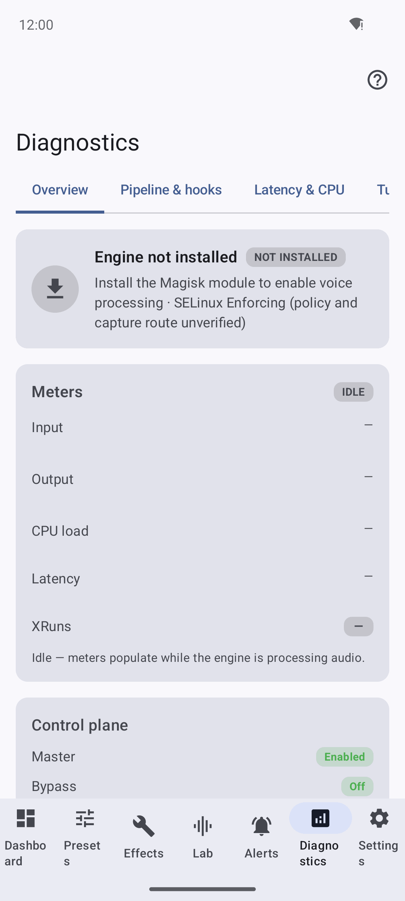

The Overview tab: **Engine not installed**, idle meters (Input/Output/CPU/Latency/
XRuns all blank because no native engine is processing audio), and the control
plane (Master enabled, Bypass off).

### Pipeline and hooks

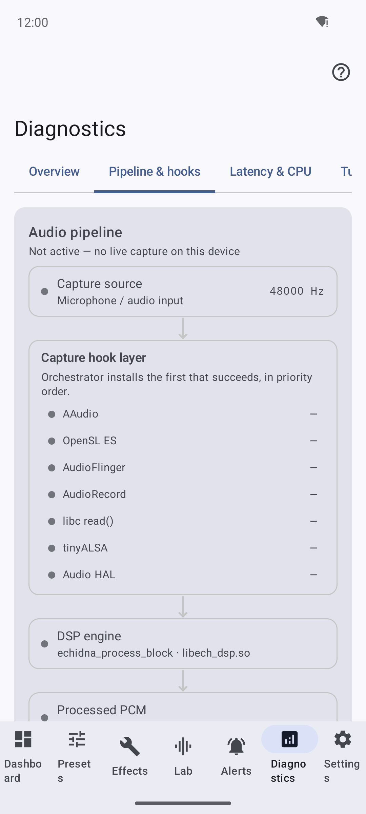

The audio-pipeline graph (HAL -> DSP engine -> processed PCM -> app/system
consumer). Honest note: **no signal flows because the engine is not hooking audio
on this device**; on a rooted device with the Zygisk module active the winning
capture hook is highlighted and audio animates along the path.

## Compatibility Wizard

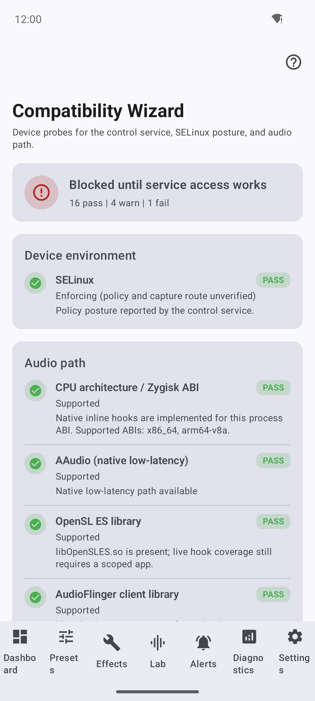

A real on-device probe: SELinux posture and the audio path (CPU/Zygisk ABI,
AAudio, OpenSL ES, AudioFlinger) pass, but the overall verdict is **"Blocked
until service access works" (16 pass | 4 warn | 1 fail)** because Magisk/Zygisk
and `su` are unavailable — the Java fallback is recommended, not proven active.

## Per-App Whitelist

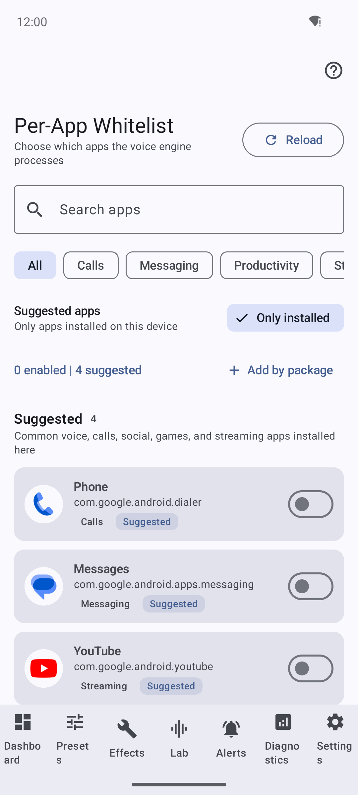

Choose which apps the engine would process. The **Only installed** filter is on,
suggested apps show single-line package names and category tags (Phone/Calls,
Messages/Messaging, YouTube/Streaming), and **0 enabled | 4 suggested** is shown.
This is configuration only — the service read-back is empty on an unrooted device,
so it is intended targeting, not an active hook.

## Install engine (guided)

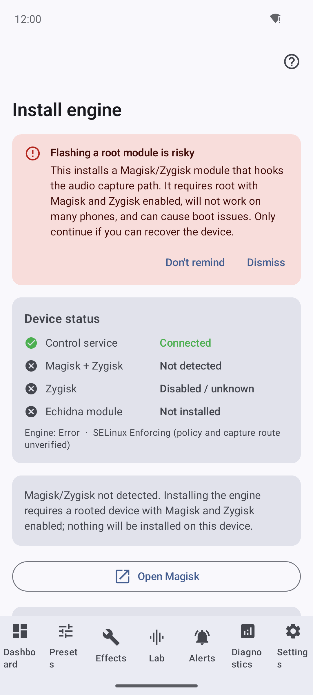

The guided installer is honest end-to-end: a red **"Flashing a root module is
risky"** banner, a **device-status** checklist (Control service **Connected**;
Magisk + Zygisk **Not detected**; Zygisk **Disabled**; Echidna module **Not
installed**), and the plain message *"Magisk/Zygisk not detected... nothing will
be installed on this device."*

## Settings

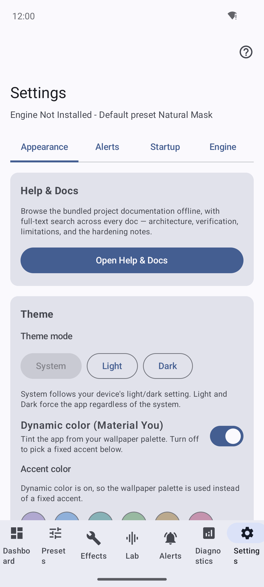

A live capture of the tabbed Settings surface (Appearance / Alerts / Startup /
Engine / Safety). The Appearance tab holds **Help & Docs**, the theme mode,
Material You and accent controls; other tabs cover startup/system integration,
notifications, the Compatibility Wizard and Per-App Whitelist entries, and
**Run setup again**.

## Quick Settings tile

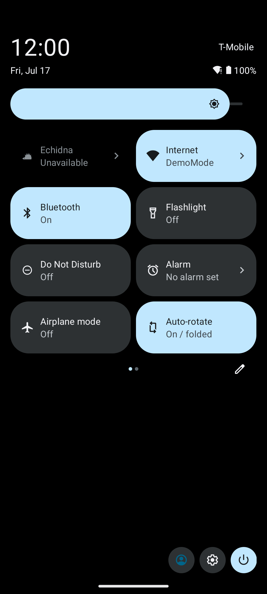

The live-registered Quick Settings tile in the shade reads **"Echidna ·
Unavailable"** because the native module is not active on the unrooted emulator.
It is genuinely drawn in the shade, not merely declared in the manifest.

## Home-screen widgets

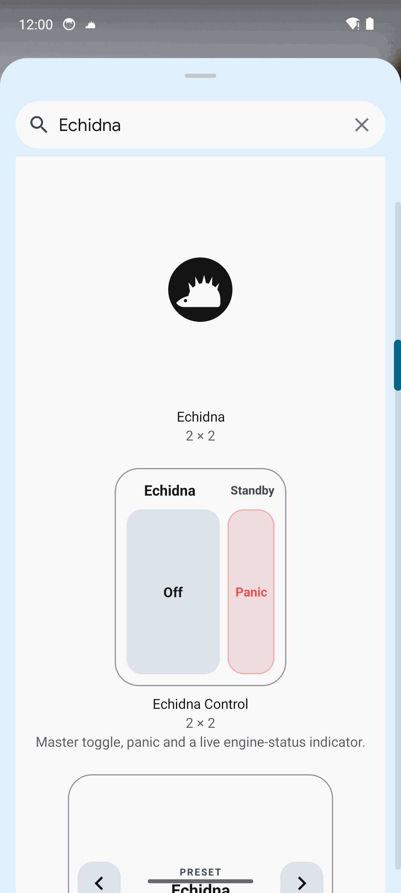

Echidna ships **three** home-screen widgets, shown here in the launcher's widget
picker: a 2x2 **Echidna** shortcut, **Echidna Control** ("Master toggle, panic
and a live engine-status indicator"), and a **Preset** switcher. On this device
the live status honestly reflects the engine being unavailable.
