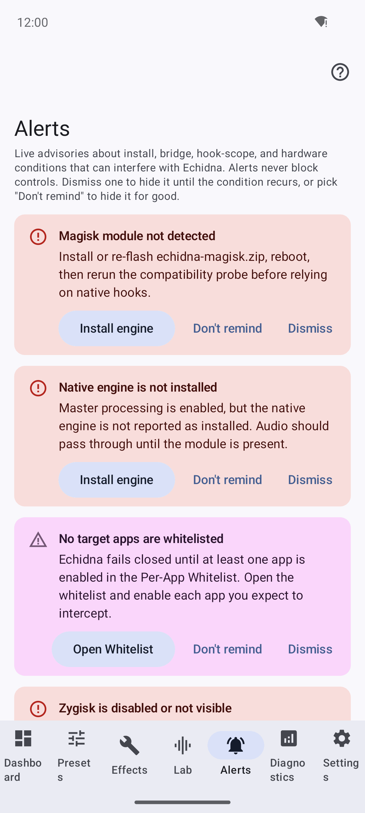
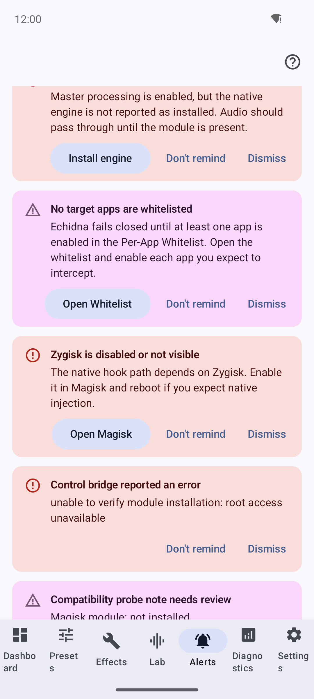

# Alerts — advisory warnings that never block you

The **Alerts** tab surfaces live advisories about conditions that can interfere
with Echidna: incomplete installs, bridge / hook-scope problems, hardware and
audio-stack gaps, and install "mix-up" states. Alerts are **advisory only** — they
never block a control — and they are **derived live** from the current device
state, so the list reflects reality rather than stale notifications.

!!! info ":material-radar: Alerts are computed, not stored"
    Nothing is persisted except your dismissals. Each time the tab reconciles, it
    rebuilds the alert list from the actual control state (engine status,
    whitelist, Zygisk/SELinux probes, telemetry, ABI/vendor detection…). Clear the
    underlying condition and the alert goes away on its own.

---

## The Alerts tab

*The Alerts tab. On an unrooted device you'll typically see install/bridge
advisories like "Magisk module not detected" and "Native engine is not installed"
— honest reflections of the missing engine.*

The header explains the scope:

> *"Live advisories about install, bridge, hook-scope, and hardware conditions that
> can interfere with Echidna. Alerts never block controls. Dismiss one to hide it
> until the condition recurs, or pick 'Don't remind' to hide it for good."*

When nothing needs attention you'll see the empty state:

> *"No active alerts. Everything Echidna can check looks healthy."*

---

## Dismissible vs. actionable

Every alert can be dismissed two ways:

| Action | Behaviour |
| ------ | --------- |
| :material-close: **Dismiss** | Temporary — hides it, but it returns if the condition clears and later recurs. |
| :material-bell-off: **Don't remind** | Permanent — memorised, never shown again. |

*An actionable alert carries a leading button that routes you straight to the fix —
here, "Install engine". Advisory-only alerts show guidance text with no dead
button.*

**Actionable** alerts additionally carry a leading button that takes you straight
to the relevant screen:

| Button | Goes to |
| ------ | ------- |
| :material-download: **Install engine** | The guided installer. |
| :material-android: **Open Magisk** | The Magisk app. |
| :material-format-list-checks: **Open Whitelist** | The per-app whitelist. |
| :material-auto-fix: **Run Wizard** | The Compatibility Wizard. |

Alerts that are purely informational show guidance text with **no** button, so
there's never a dead control.

---

## What gets flagged

Alerts fall into four categories, each toggled by its own setting (the setup
wizard's single ["Advisory alerts"](getting-started.md#step-8-advisory-alerts)
switch flips all four at once). Install, incomplete-bridge, and bridge-risk items
are shown as **errors**; the rest as **warnings**.

=== ":material-package-down: Install"

    - Control service status unavailable
    - **Magisk module not detected** — *"Install or re-flash echidna-magisk.zip,
      reboot…"*
    - **Native engine is not installed** *(→ Install engine)*

=== ":material-transit-connection-variant: Bridge / hook-scope"

    - **No target apps are whitelisted** — *"Echidna fails closed until at least one
      app is enabled…"* *(→ Open Whitelist)*
    - Engine status reports an error
    - **Zygisk is disabled or not visible** *(→ Open Magisk)*
    - SELinux or policy probe needs attention *(→ Run Wizard)*
    - Module status warning · control bridge error · compatibility probe not
      run / needs review

=== ":material-chip: Hardware"

    - CPU ABI not packaged / limited native hook support
    - Vendor audio family not classified
    - AAudio low-latency / OpenSL ES / AudioFlinger / tinyalsa library unavailable
    - Low-latency or pro-audio feature absent
    - Audio HAL unidentified · incomplete audio-stack probe
    - **High processing latency** / **Audio XRuns detected** (from telemetry)

=== ":material-swap-horizontal: Install mix-up"

    - **Magisk module present but Zygisk is not active** *(→ Open Magisk)*
    - Native capture route remains unverified
    - LSPosed compatibility mode recommended
    - Native module missing; fallback is only a recommendation *(→ Install engine)*
    - Compatibility mode selected with native module present

!!! note ":material-eye-check: Alerts describe, they don't fix"
    An alert tells you the truth about a condition — for example that the engine
    isn't installed or no app is whitelisted. Following an action button takes you
    to the relevant screen, but installing the engine and getting live interception
    working remains device-gated. See [Verification](verification.md) and
    [Limitations](limitations.md).

---

## Related

- :material-rocket-launch: [Getting Started](getting-started.md) — the advisory-alerts master toggle is step 8.
- :material-hammer-wrench: [Build & Install](build-install.md) — the install path the install/bridge alerts point at.
- :material-shield-check: [Verification](verification.md) — what "installed" does and doesn't prove.
