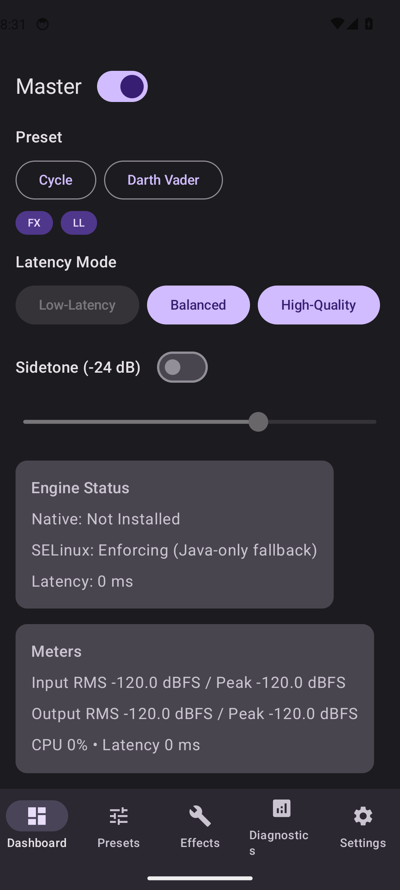

<div align="center">

# Echidna

### Native-first, root real-time voice changer for Android

Hook the audio path directly inside target apps — transform your voice in calls,
recordings, and games with a low-latency native DSP engine, per-app profiles, and
a rich companion app.

⚠️ Root-module warning: Android capture-path interception is very hard and device-specific.
Echidna is likely not to work on many phones; do not install or flash it unless you can recover
the device if a Magisk/Zygisk module breaks boot.

[](https://github.com/supermarsx/echidna/actions/workflows/ci.yml)
[](https://github.com/supermarsx/echidna/actions/workflows/docs.yml)
[](license.md)
[](docs/build-install.md)
[](docs/limitations.md)
[](docs/architecture.md)

<br />


<br />
<sub>Actual app entry screen captured from the emulator; the full gallery is in the docs.</sub>

</div>

---

> [!DANGER]
> ⚠️ Echidna is experimental root software and may be incompatible with the phone
> you are using. Do not install it unless you already know how to disable a
> Magisk/Zygisk module manually from recovery, adb, safe mode, or another
> out-of-band rescue path if the phone bootloops. If you cannot recover from a
> bad module without the normal Android UI, do not flash this.
> The companion APK's service/AIDL round-trip is instrumented, but the live
> root-module paths above are not proven on release hardware yet.
> Even correct builds may fail on strict SELinux policies, unusual vendor HALs,
> unsupported ABIs, or Magisk/LSPosed combinations this project has not tested.

## Table of Contents

- [What is Echidna](#what-is-echidna)
- [High-Risk Notice](#high-risk-notice)
- [Features](#features)
- [Quickstart](#quickstart)
- [Release Files](#release-files)
- [Install Methods](#install-methods)
- [How Echidna Functions](#how-echidna-functions)
- [Architecture](#architecture)
- [Documentation](#documentation)
- [Comparison & Limitations](#comparison--limitations)
- [Contributing](#contributing)
- [License](#license)

---

## What is Echidna

Echidna is a **native-first, root-based real-time voice changer** for Android. Instead of
routing audio through a virtual device or a userspace app, it uses **Zygisk + LSPosed** to
inject processing into selected target processes. The current normal-flow native candidates are
AAudio, OpenSL ES, and tinyalsa; the LSPosed shim covers Java `AudioRecord`. Native
`AudioRecord` and raw libc capture are developer-contract routes, while Audio HAL and
AudioFlinger transforms are deliberately unsupported until a safe injection boundary exists.
An Android legacy input-preprocessor effect ABI is packaged and can be registered for the next boot
on proven legacy-HIDL system/vendor configurations. It remains default-off and is never
auto-applied. An experimental companion toggle only permits authorized LSPosed attachment to an
eligible `AudioRecord` session; enabling it is not proof that the effect loaded or processed audio.
Captured PCM is processed by a C++17 DSP engine (`libech_dsp.so`) and written back in place.
A Jetpack Compose companion app drives presets, per-app profiles, diagnostics, and safety
controls. It targets power users and researchers on rooted devices; it is not a Play Store app.

## High-Risk Notice

⚠️ Echidna is an **experimental project** for a narrow subset of Android users who already understand
bootloader unlocks, Magisk, Zygisk, LSPosed, SELinux, sideloaded APKs, and recovery. It may be
incompatible with your device, vendor audio stack, CPU ABI, Magisk build, or other installed root
modules. It can affect system audio processes and root-level boot behavior. If you misconfigure it,
flash it on the wrong device, combine hook stacks badly, or recover incorrectly, you can soft-brick a
phone and, in extreme cases, contribute to a hard-brick scenario. If you do not already know how to
disable a Magisk/Zygisk module without booting normally, you should not install Echidna. You are
responsible for backups, recovery images, device-specific research, and every install decision. The
software is provided as-is, without warranties or guarantees of functioning.

Intended module failsafes are documented for users and release testers:

- Create Magisk's module disable marker for `echidna` before rebooting if the module looks wrong.
- Create `/data/adb/echidna/disable` or boot via the project's safe-mode path to keep Echidna
  inactive.
- Create `/cache/echidna-disable` or `/metadata/echidna-disable` from recovery when `/data` is not
  writable or not mounted yet.
- Treat the automatic boot watchdog as a last-resort guard, not as a substitute for knowing how to
  disable the module yourself.

**Already bootlooping?** Follow the step-by-step recovery ladder in
[Recovering from a bootloop](docs/recovery.md) — boot with all modules off, create an Echidna disable
marker, or, as a last resort, `fastboot flash boot boot.img` to remove Magisk (method contributed by
[issue #17](https://github.com/supermarsx/echidna/issues/17)).

## Features

| Area | Capabilities |
| --- | --- |
| **Capture routes** | AAudio, OpenSL, and tinyalsa native candidates; LSPosed Java `AudioRecord` fallback; a non-shipping Phase 1 legacy preprocessor; explicit developer-only and unsupported routes. |
| **DSP effects** | Noise gate, EQ, compressor/AGC, pitch shift, formant shift, Auto-Tune, reverb, dry/wet mix — SIMD-tuned. |
| **Presets** | Built-in catalog (Natural Mask, Darth Vader, Helium, Radio Comms, Studio Warm, Robotizer, Cher-Tune, Anonymous) with import/export. |
| **Per-app whitelist** | Enable Echidna per application and bind a specific preset to each app. |
| **Latency modes** | Low-latency in-callback processing and a hybrid worker pipeline. |
| **Quick Settings tile** | Toggle the engine from the notification shade. |
| **Diagnostics** | Latency and CPU sampling, symbol-scan logs, tuner, compatibility wizard. |
| **Safety** | Panic bypass, auto-bypass on overload, SELinux-aware deployment, fail-closed defaults. |

## Quickstart

Full, host-verified steps live in **[docs/build-install.md](docs/build-install.md)**. In short:

```bash
git clone https://github.com/supermarsx/echidna.git
cd echidna

# 1. Build the per-ABI native libraries (needs the Android NDK)
ANDROID_NDK=/path/to/ndk bash tools/build_native_ndk.sh
#    …or reproducibly in Docker:
docker build -t echidna-native docker/native-build && \
docker run --rm -v "$PWD:/workspace" echidna-native

# 2. Package the flashable Magisk module
bash tools/build_magisk_module.sh   # -> out/echidna-magisk.zip

# 3. Build the companion APK and, if needed, the LSPosed shim
cd android/app && ./gradlew :app:assembleDebug   # or assembleRelease with a keystore
cd ../lsposed-shim && ./gradlew :shim:assembleRelease
```

Then, **on a rooted device** (Magisk 24+ with Zygisk enabled, LSPosed installed):

1. Flash `out/echidna-magisk.zip` in Magisk and reboot.
2. Install the companion APK and open it.
3. Enable the Echidna module in **Zygisk / LSPosed**.
4. Add your target apps in the **per-app whitelist** and pick a preset.
5. Run the **compatibility wizard** and **diagnostics** before enabling hooks for production apps.

> Policy delivery supports multiple authenticated targets: Zygisk readers use UID-scoped policy v2
> over the service-owned abstract socket, while LSPosed uses a caller/process-scoped read-only Binder
> provider. Do not assign the same process to both capture owners. See
> [Limitations](docs/limitations.md).

Current validation goes beyond a compile: Android instrumentation proves the in-app control service
and native `processBlock` path on Android 13/14 emulators. A rooted-emulator
`AudioRecord.read` probe also passed before the current explicit-contract route redesign; it is
historical evidence, not proof that the current native `AudioRecord` route is reachable. Magisk
flashing, live LSPosed injection, and every current capture route still need device validation.

## Release Files

Every successful `main` CI release publishes a GitHub Release with separate installable files:

- `echidna-companion-<tag>.apk` - install this Android companion app first. It
  contains the UI and in-process control service.
- `echidna-magisk-<tag>.zip` - flash this in Magisk to install the native
  Zygisk/DSP engine.
- `echidna-lsposed-shim-<tag>.apk` - optional Java fallback for LSPosed-scoped
  apps that use `AudioRecord`.
- `echidna-apks-<tag>.zip` - convenience package containing the companion APK
  and LSPosed shim APK.
- `echidna-native-libs-<tag>.zip` - raw per-ABI `.so` files for inspection or
  integrators, not the normal install path.
- `echidna-complete-<tag>.zip` - all release assets plus `RELEASE_ARTIFACTS.md`;
  useful for archiving a full release.
- `SHA256SUMS.txt` - hashes for verifying downloaded release files.

Use the newest release unless you are intentionally rolling back or already understand the
recovery risk. Earlier releases can contain boot/module bugs that were fixed later and may be
harder to recover from after flashing.

Hosted releases are signed with a configured release certificate and fail closed if signing inputs
are absent or invalid. An older debug-signed companion or shim cannot be upgraded in place to an APK
signed by a different certificate; back up needed app data, uninstall the old package once, and then
install the release-signed APK. See [Signing](docs/signing.md).

For a normal install, use the companion APK plus the Magisk zip. Add the LSPosed shim only when you
need or are testing the Java fallback path. Do not scope the same target app into both Zygisk and
LSPosed unless you are intentionally testing duplicate-hook behavior.

## Install Methods

- **Prebuilt release:** download the release assets, verify `SHA256SUMS.txt`,
  install the companion APK, flash the Magisk zip, reboot, then run Diagnostics.
- **Local host build:** build APKs with Gradle, cross-compile native libraries
  with `tools/build_native_ndk.sh`, then package `out/echidna-magisk.zip`.
- **Docker build:** use `docker/compose.yaml` to run native build, Android
  build, and Magisk packaging with pinned toolchains.
- **Development/debug APK only:** install `app-debug.apk` when you only want to
  inspect UI behavior. No audio is transformed until the Magisk module/native
  path is installed.

Device activation is always manual: enable Zygisk in Magisk, install or enable LSPosed only if you
need the fallback shim, whitelist target apps in the companion, then run the compatibility wizard.

## How Echidna Functions

Echidna has several operating paths:

- **Native-first Zygisk path:** the Magisk module loads `libechidna.so` into selected target
  processes. AAudio, OpenSL, and tinyalsa are the normal-flow capture candidates and route PCM
  through `libech_dsp.so`; all remain device/vendor gated.
- **LSPosed Java fallback:** the optional shim covers Java `AudioRecord` apps that never hit the
  native hook path through a dedicated JNI bridge and DSP library. It fetches strict v2 policy from
  an explicit read-only Binder provider that authenticates the target UID and claimed process.
- **Legacy input preprocessor:** the standard legacy effect ABI boundary and its DSP context pass
  host ABI/lifecycle/audio/real-time tests. Eligible devices can stage next-boot registration, and
  the default-off experimental setting permits LSPosed to request authorized per-session attachment.
  Device load, enforced-SELinux activation, and audio-mutation proof remain outstanding.
- **Developer-contract routes:** native `AudioRecord` and raw libc `/dev/snd` capture stay disabled
  unless an explicit sample-rate/channel/format contract is supplied by a developer.
- **Unsupported boundaries:** Audio HAL and AudioFlinger report
  `unsupported_injection_boundary`; current app-process Zygisk injection cannot safely own them.
- **Compatibility mode:** the app can prefer safer fallback behavior on fragile devices or unknown
  HALs while still keeping controls available.
- **Bypass and panic:** bypass passes audio through untouched. Panic is an independent timed
  admission gate that preserves the configured master/bypass state and publishes a new generation
  when it expires.

## Architecture

Echidna is four cooperating layers. The **companion app** hosts an in-process private control
service plus an authenticated read-only policy provider. Strict, monotonic policy v2 reaches
Zygisk through a UID-scoped service-owned abstract socket and LSPosed through process-scoped Binder.
The **Zygisk native module** injects into selected target processes, discovers eligible audio
symbols, and streams captured buffers to the **DSP engine**. An **LSPosed Java shim** covers Java
`AudioRecord` paths. Read the full walkthrough — hook order, IPC, and data flow — in
**[docs/architecture.md](docs/architecture.md)** and the reasoning
behind each choice in **[docs/design-rationale.md](docs/design-rationale.md)**.

```
Capture source
    ├─ operational candidates: AAudio / OpenSL / tinyalsa
    ├─ LSPosed fallback: Java AudioRecord
    ├─ device-gated: legacy input preprocessor (default-off authorized attachment candidate)
    ├─ developer contract: native AudioRecord / libc read
    └─ unsupported: Audio HAL / AudioFlinger
                  ↓ eligible buffers
            DSP (libech_dsp.so)
```

**Stack:** Kotlin + Jetpack Compose (Material3) companion app · in-app control service (AIDL, JNI) ·
Java/Xposed LSPosed shim · C++17 native (CMake + NDK r27, per-ABI) · flashable Magisk/Zygisk module.

## Documentation

The full documentation site is built with MkDocs Material and published to
**[GitHub Pages](https://supermarsx.github.io/echidna/)**.

| Topic | Page |
| --- | --- |
| Architecture & data flow | [architecture.md](docs/architecture.md) |
| Design rationale | [design-rationale.md](docs/design-rationale.md) |
| Why this is hard to build | [why-hard.md](docs/why-hard.md) |
| Build & install | [build-install.md](docs/build-install.md) |
| Recovering from a bootloop | [recovery.md](docs/recovery.md) |
| DSP & effects reference | [dsp-effects.md](docs/dsp-effects.md) |
| Screenshots gallery | [screenshots.md](docs/screenshots.md) |
| Comparison vs alternatives | [comparison.md](docs/comparison.md) |
| Limitations | [limitations.md](docs/limitations.md) |
| E2E verification report | [verification.md](docs/verification.md) |
| Performance methodology | [performance-testing.md](docs/performance-testing.md) |
| Vendor HAL analysis | [vendor-hal-analysis.md](docs/vendor-hal-analysis.md) |
| Developer guide · Signing · Magisk release | [developer_readme.md](docs/developer_readme.md) · [signing.md](docs/signing.md) · [magisk_release.md](docs/magisk_release.md) |

## Comparison & Limitations

Unlike app-level tools (RootlessJamesDSP, Voicemod-style desktop apps, Clownfish) or generic
Magisk audio-mod modules, Echidna intercepts **inside the target process** for true real-time,
per-app transformation. That power comes with constraints: it **requires root**, behaviour varies
across OEM audio HALs and SELinux policies, `armeabi-v7a` hooking degrades gracefully (fails
closed), and HAL/AudioFlinger transformation is not implemented. Policy delivery is authenticated
and process-scoped, but capture-owner configuration still must not assign both hook stacks. See
**[comparison.md](docs/comparison.md)** and **[limitations.md](docs/limitations.md)** for the honest
detail.

## Contributing

Contributions that respect the native-first architecture and DSP performance goals are welcome:

- Follow the coding standards in [`agents.md`](agents.md) for C++17, Kotlin/Java, and scripting.
- Keep commits focused, with descriptive messages and documented test results.
- Update the relevant docs when you change user-visible behaviour or preset formats.
- Run the native, Android, and DSP tests before opening a pull request (or document why they
  could not run). See [build-install.md](docs/build-install.md) and [verification.md](docs/verification.md).

## License

Echidna is released under an **MIT-derived non-commercial license** with a
separate commercial license requirement — see [license.md](license.md).
Use it responsibly: only transform audio you are authorised to modify, and comply with the terms
of the apps and services you use it with.
